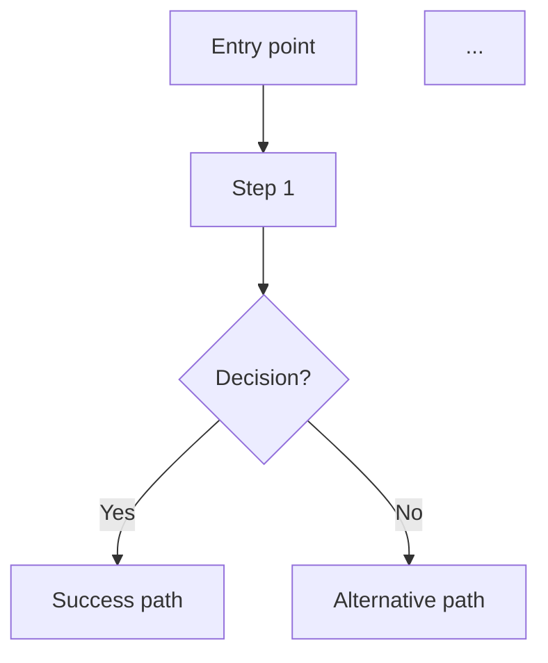

# user-story-to-spec Skill

Converts one or more Agile or capability-domain user stories into a structured, implementation-friendly
engineering specification document (spec.md). The output is used by architects and engineers as the
basis for system design and task breakdown — not as a low-level design document itself.

---

## When to Use This Skill

Trigger on any of these signals:
- User provides one or more Jira stories, user stories, or capability stories and asks for a spec
- User says "convert to a spec", "generate a spec", "write an engineering spec", "create a requirements doc"
- User wants to consolidate multiple stories about the same platform or feature into one document
- Input describes a workflow platform, DevOps system, backend service, or multi-stage feature
- User shares story text without explicit instructions — producing a spec is the natural next step

---

## Core Process

### Step 0 — Codebase Grounding Pass (MANDATORY)

Before writing a single line of the spec, scan the user stories for any claim that references existing code, existing system behavior, existing endpoints, existing columns, existing services, or existing constants. For every such claim:

1. Grep or Read the referenced file / method / class / column
2. If the claim matches reality, proceed
3. If the claim is wrong, correct it in the generated spec AND flag the correction at the top of your response
4. If you cannot verify, tag the downstream claim `[UNVERIFIED]`

Also note: **user stories often contain implicit assumptions about existing behavior** ("the existing login flow", "as we already do for X agent"). Those implicit assumptions must also be grounded, not inherited blindly.

See `../_shared/grounding-rules.md` (Rule 1) for the full protocol and examples.

### Step 1 — Ingest and Parse All Stories

Read every story provided. For each one, identify:
- **Story ID / Title** (for traceability)
- **Actor(s)**: who performs or benefits from the capability
- **Capability / Goal**: what the actor wants to do
- **Business Value**: why it matters
- **Acceptance Criteria**: testable conditions of satisfaction
- **Constraints, dependencies, or stated non-functional requirements**

If story IDs or titles are not provided, assign sequential labels (Story 1, Story 2…) for traceability.

### Step 2 — Analyse and Consolidate

Before writing, analyse the full set of stories:
- **Group** stories that describe the same platform, domain, or lifecycle
- **Identify overlaps**: duplicate or near-duplicate requirements across stories
- **Detect conflicts**: contradictory rules, states, or behaviours — flag these explicitly
- **Identify gaps**: things implied but never stated; mark these as assumptions
- **Separate confirmed requirements** (stated in stories) from **inferred details** (gaps you filled)
- **Do not invent product decisions**, business rules, or technical constraints that are not supported by the source stories. If additional detail is needed, mark it as `[INFERRED]` and raise it under `Risks / Ambiguities` or `Open Questions`.


### Step 3 — Classify Requirements

Separate every requirement into:
- **Functional** — what the system must do (behaviours, rules, workflows, states)
- **Non-functional** — how the system must perform it (security, reliability, performance, observability, auditability, environment support)

### Step 4 — Structure the Spec

Produce the spec using the output format below. Every section must be present. If a section has no
content, write `None identified` — never omit sections.

### Step 5 — Quality Check + Pre-Ship Consistency Sweep

Before outputting, verify the spec-specific quality items:
- [ ] Every source story is referenced at least once in the spec
- [ ] All acceptance criteria from the source stories are captured (possibly consolidated)
- [ ] Functional and non-functional requirements are clearly separated
- [ ] Confirmed requirements are distinguished from assumptions / inferences
- [ ] Conflicts and ambiguities are called out, not silently resolved
- [ ] The spec is implementation-friendly but does not specify low-level solution design
- [ ] Language is concise, professional, and engineering-appropriate

Then run the **shared Pre-Ship Checklist** from `../_shared/grounding-rules.md`:
- [ ] F1 — Every method/class/file/annotation reference is grep-verified or tagged `[UNVERIFIED]`
- [ ] F2 — Every "the existing X already does Y" claim is verified or tagged
- [ ] F3 — No design/tasks-level content (no file paths, no class signatures, no code)
- [ ] F4 — Scope / assumptions / requirements / tests / success criteria do not contradict
- [ ] F5 — Every new rule traced against 3 edge cases
- [ ] F6 — No "implementation will decide" language
- [ ] F7 — No blindly inherited claims from user stories; all re-verified

**Specific contradiction hotspots for specs:** Scope vs. Out of Scope · Functional Requirements vs. Testing Considerations · "already supported" assumptions vs. the items you're adding to the feature.

---

## Output Format

Output a single `spec.md` document. Use this exact structure:

```markdown
# Feature Specification: <Feature Name>

> **Source stories:** <Story IDs or titles>
> **Spec status:** Draft
> **Last updated:** <today's date>

---

## Overview

**Feature summary:**
<1–3 sentence description of what is being built>

**Business objective:**
<Why this feature matters — the outcome it enables for the business or user>

**In-scope outcome:**
<What success looks like at delivery — the observable end state>

---

## Source Stories

| Story | Title / Summary | Key Capability |
|-------|----------------|----------------|
| <ID>  | <title>        | <one-line summary of what this story contributes> |

---

## Actors / Users

**Primary actors** (directly interact with or trigger the system):
- <Actor>: <brief role description>

**Supporting actors** (indirectly involved or upstream/downstream):
- <Actor>: <brief role description>

---

## Functional Scope

**Core capability domains:**
- <Domain 1>: <what it covers>
- <Domain 2>: <what it covers>

**Lifecycle stages:**
<Ordered list or prose description of the end-to-end stages the feature passes through>

**Workflow boundaries:**
- Entry point: <what triggers the feature / workflow>
- Exit point: <what constitutes completion or terminal state>
- Out-of-band transitions: <cancellations, failures, retries, escalations>

---

For platform, workflow, and DevOps systems, prefer grouping requirements by capability domain rather than by isolated UI actions.

## Functional Requirements

> Requirements marked `[INFERRED]` are not explicitly stated in source stories but are logically
> required. Confirm with the product owner before treating as committed scope.

### <Capability Domain 1>

- **FR-01**: <Requirement statement>  *(Source: Story X)*
- **FR-02**: <Requirement statement>  *(Source: Story X, Story Y)*
- **FR-03**: <Requirement statement>  `[INFERRED]`

### <Capability Domain 2>

- **FR-04**: <Requirement statement>  *(Source: Story Z)*

*(Group all functional requirements by capability domain. Use FR-NN identifiers sequentially.)*

---

## Non-Functional Requirements

> Requirements marked `[INFERRED]` were not explicitly stated but are standard expectations for
> this class of system.

- **Security**: <auth, authz, secret handling, data sensitivity requirements>
- **Reliability**: <uptime, retry, idempotency, failure tolerance expectations>
- **Auditability**: <what must be logged, for how long, and who can access audit trails>
- **Observability**: <metrics, tracing, alerting expectations>
- **Performance**: <throughput, latency, concurrency expectations>
- **Environment support**: <environments this must work in: dev, staging, prod, etc.>
- Include only the non-functional categories that are relevant to the input. If a category is not mentioned and not reasonably implied, write `None identified`.

---

## Workflow / System Flow

### User Flow Diagram

**REQUIRED**: Produce a Mermaid `flowchart` diagram that visually shows the end-to-end user journey through the system. The diagram must include:
- Entry point (how the user starts)
- Key decision points (diamonds)
- Branching paths (success, failure, different execution types)
- Loop-back paths (retries, reruns)
- Terminal states (success, failure, cancelled)
- Use `style` directives to color-code: entry (blue), success (green), error (red), warning (yellow)



### Main Flow

<Describe the end-to-end process as a numbered sequence or prose narrative. Cover:>
1. What triggers the workflow
2. Each stage in order, including decision points and branching
3. Error and exception paths
4. Terminal states (success, failure, cancelled, etc.)
5. Describe behaviour and flow, not implementation architecture. Do not introduce internal components, services, classes, or database design in this section.

---

## Data / Configuration Requirements

**Key entities:**
| Entity | Description | Key Attributes |
|--------|-------------|----------------|
| <Entity> | <what it represents> | <key fields> |

**Configuration objects / parameters:**
- <Config item>: <description, type, constraints>

**Statuses / state machine:**
- Valid states: <list>
- Valid transitions: <from → to, and what triggers each>

**Validation rules:**
- <Rule>: <what is validated and when>

---

## Integrations

**External systems:**
- <System>: <purpose of integration>

**APIs / interfaces:**
- <API / interface>: <direction (inbound/outbound), purpose>

**Credentials / secrets:**
- <Secret or credential>: <what it is used for> `[ASSUMED: stored in secrets manager]`

**Dependency assumptions:**
- <Assumed behaviour of an external system that the feature depends on>

---

## Dependencies

**Upstream dependencies** (must exist / be completed before this feature can work):
- <Dependency>: <why it is needed>

**Downstream dependencies** (systems or teams that depend on this feature):
- <Dependency>: <what they rely on>

---

## Risks / Ambiguities

| # | Description | Type | Impact | Recommendation |
|---|-------------|------|--------|----------------|
| R-01 | <description of risk or ambiguity> | Conflict / Gap / Assumption / Unclear | High / Med / Low | <suggested resolution> |

*(Types: **Conflict** = stories contradict each other; **Gap** = requirement is missing; **Assumption** = inferred without confirmation; **Unclear** = requirement is stated but too vague to implement)*

---

## Out of Scope

The following are explicitly excluded from this feature:
- <Item>: <brief rationale>

---

## Open Questions

| # | Question | Raised from | Owner |
|---|----------|-------------|-------|
| OQ-01 | <question that must be resolved before implementation> | Story X / Inferred | Product / Eng / Arch |

```

---

## Handling Edge Cases

**Single story input:**
Still produce the full spec structure. A single well-written story often has implicit NFRs, integration
assumptions, and open questions that the spec should surface.

**Conflicting stories:**
Do not silently pick one interpretation. Record both in Risks / Ambiguities as a Conflict, state both
interpretations, and raise an Open Question for resolution.

**Very large or vague stories:**
If a story is too broad to consolidate cleanly, say so in Risks / Ambiguities. Do not invent
specificity that isn't there.

**Stories that are too thin:**
If a story lacks actors, acceptance criteria, or a stated benefit, note the gap. Make a reasonable
inference, mark it `[INFERRED]`, and raise an Open Question for confirmation.

**Stories about a shared platform (e.g., a workflow or DevOps platform):**
Consolidate into a single feature spec. Do not produce one spec per story. The lifecycle stages,
task states, and integration points should be unified across all stories.

---

## Reference Files

- `references/nfr-defaults.md` — Standard NFR defaults for common system types (APIs, workflow engines, DevOps platforms)
- `references/spec-anti-patterns.md` — Common mistakes to avoid when writing specs
- `examples/devops-platform-spec.md` — Example output for a multi-story DevOps workflow platform

Read these if you need additional calibration on edge cases or NFR defaults.
