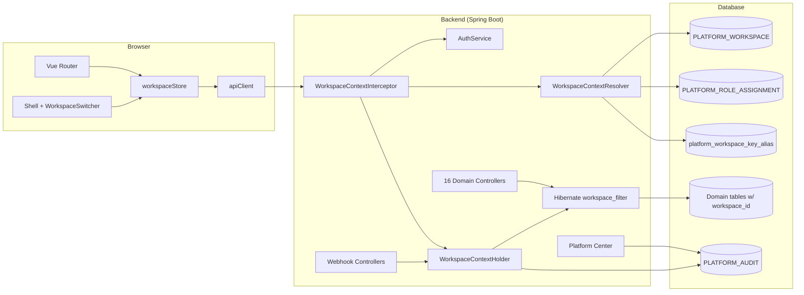
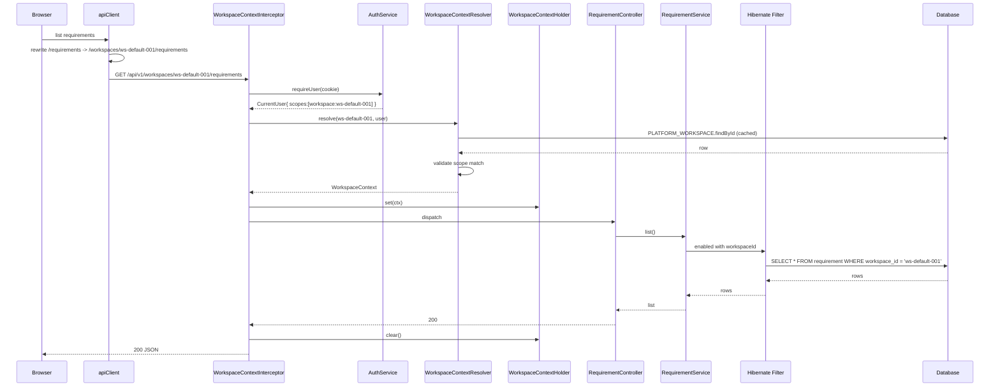
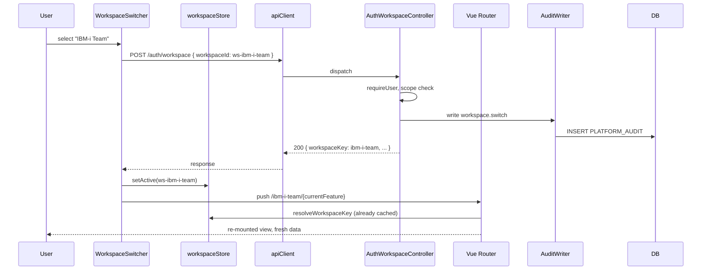
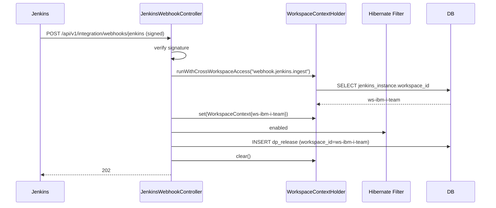
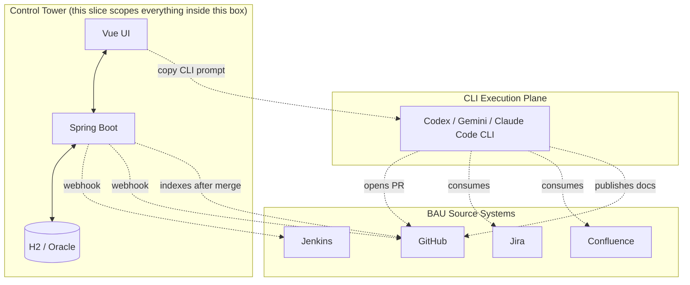

# Multi-Tenancy Foundation Architecture

## Context

The current platform serves a single tenant in practice: every domain
controller runs without auth gating, every domain repository queries
without workspace filtering, and `WorkspaceContextService` returns the
first row of `workspace_context` for every caller. This slice rebases
the runtime so all 16 domain controllers, all 84 entities, and all 13
frontend features observe a single workspace context derived from the
authenticated user and the URL path.

The architecture is intentionally minimal: one interceptor, one
ThreadLocal holder, one Hibernate filter, one frontend interceptor, one
router parent route. New domain code does not need to think about
multi-tenancy — the framework handles it.

## System Context



## Components

### Backend

| Component | Responsibility |
|---|---|
| `WorkspaceContextInterceptor` | Spring `HandlerInterceptor` registered for `/api/v1/**`. Resolves auth + workspace, sets `WorkspaceContextHolder`, clears in `afterCompletion`. |
| `WorkspaceContextResolver` | Stateless service that turns `(workspaceId, currentUser)` into a validated `WorkspaceContext` or throws. Owns the 60s caches. |
| `WorkspaceContextHolder` | `ThreadLocal<WorkspaceContext>` plus `runWithCrossWorkspaceAccess` escape hatch. |
| `WorkspaceFilterAspect` | Spring AOP advice around `@Transactional` boundaries. Enables `workspace_filter` on the active Hibernate session using `WorkspaceContextHolder.current().workspaceId`. |
| `WorkspaceFilter` (annotation source) | Defines `@FilterDef("workspace_filter")` once for the whole app. Every workspace-scoped entity declares `@Filter("workspace_filter")`. |
| `AuthWorkspaceController` | New endpoints: `POST /auth/workspace`, `GET /auth/workspaces`, `GET /auth/workspaces/by-key/{key}`. |
| `AuthService` (extended) | Persists workspace switch audit; signs `sdlc_workspace` cookie. |
| `WorkspaceKeyAliasService` | Manages `platform_workspace_key_alias` table; resolves former keys for 30 days post-rename. |
| 16 domain controllers | Get a new `@RequestMapping` prefix `/api/v1/workspaces/{workspaceId}/...`. No other body change required for this slice. |

### Frontend

| Component | Responsibility |
|---|---|
| `apiClient` (interceptor) | Rewrites every non-allowlisted URL to inject `/workspaces/{workspaceId}` after `/api/v1`. |
| `workspaceStore` | Pinia store holding `{ workspaceId, workspaceKey, applicationId, snowGroupId, profileId, ... }`; populated from `GET /auth/workspaces` and `GET /auth/me`. |
| `WorkspaceSwitcher.vue` | Top-bar component, dropdown of authorized workspaces, calls `POST /auth/workspace`, navigates to `/{newKey}/<feature>`. |
| Vue Router | Top-level `/:workspaceKey` parent route with `beforeEnter` resolver; auth allowlist routes outside (`/login`, `/no-access`, `/demo/*`, `/platform/*`). |
| `resolveWorkspaceKey` (router guard) | Resolves key → id from cache or `GET /auth/workspaces/by-key/{key}`. Handles 301 alias redirect, 404, unauthorized. |

## Package Layout

### Backend

```text
backend/src/main/java/com/sdlctower/
  platform/workspace/
    WorkspaceContext.java                 (record)
    WorkspaceContextHolder.java
    WorkspaceContextInterceptor.java
    WorkspaceContextResolver.java
    WorkspaceContextController.java       (existing, moved under prefix)
    WorkspaceKeyAliasService.java
    WorkspaceKeyAliasEntity.java
    WorkspaceKeyAliasRepository.java
    PlatformWorkspaceEntity.java          (new JPA mapping for PLATFORM_WORKSPACE)
    PlatformWorkspaceRepository.java
  platform/auth/
    AuthWorkspaceController.java          (new)
    AuthService.java                      (extended: workspace switch + cookie)
  shared/persistence/
    WorkspaceFilter.java                  (FilterDef holder)
    WorkspaceFilterAspect.java
    WorkspaceScopedEntityValidator.java   (test-only; enumerates @Entity + workspace_id)
  config/
    WebMvcConfig.java                     (registers interceptor)
```

### Frontend

```text
frontend/src/
  shell/
    components/
      WorkspaceSwitcher.vue               (new)
    composables/
      useWorkspaceGuard.ts                (router guard)
  shared/
    api/
      apiClient.ts                        (interceptor added)
      workspaceApi.ts                     (extended: switch / by-key)
    stores/
      workspaceStore.ts                   (extended: workspaces map, key resolution)
    types/
      shell.ts                            (extended: Workspace, WorkspaceList)
  router/
    index.ts                              (rebased under :workspaceKey)
    guards/
      resolveWorkspaceKey.ts              (new)
```

## Data Flow: authenticated domain request



## Data Flow: workspace switch (UI)



## Data Flow: webhook ingest



## State Boundaries

| State | Lives in | Lifetime |
|---|---|---|
| Authenticated user (staffId, scopes) | `sdlc_session` cookie | Session TTL |
| Last-selected workspace | `sdlc_workspace` cookie + `localStorage.workspace.{staffId}` | 30 days |
| `PLATFORM_WORKSPACE` cache | `WorkspaceContextResolver` in-memory | 60 s |
| `project → workspace` cache | `WorkspaceContextResolver` in-memory | 60 s |
| Active request workspace | `WorkspaceContextHolder` ThreadLocal | One HTTP request |
| Cross-workspace flag | `WorkspaceContextHolder` ThreadLocal | One escape-hatch block |
| Frontend `workspaceStore` | Pinia, in-memory | One browser session |
| Frontend workspaces list | `workspaceStore.workspaces` | Refreshed on login + switch |

## Integration Boundary



This slice **does not** change anything in the BAU or CLI lanes. It only
adds the workspace dimension inside the Control Tower box so that every
arrow into and out of the platform carries the workspace identity.

## Failure Modes and Mitigation

| Failure | Symptom | Mitigation |
|---|---|---|
| New entity added without `@Filter` | Cross-tenant leakage on that entity | `AllWorkspaceScopedEntitiesAreFiltered` regression test fails the build |
| Code path forgets to set holder | `MISSING_WORKSPACE_CONTEXT` 500 | Loud failure beats silent leak; aspect throws on every scoped query |
| Webhook for unknown source | Could resolve to wrong workspace if defaulted | `webhook.unknown_source` audit; `404` to caller; never default |
| Workspace renamed mid-session | Old key 404 in user's tab | 30-day alias `301` redirect |
| `PLATFORM_WORKSPACE` mutated under cache | Stale auth decisions for ≤60 s | Mutation invalidates the cache; admin tooling explicit |
| `WorkspaceContextHolder` not cleared (async leak) | Wrong context for next request on same thread | `afterCompletion` always clears; `TaskDecorator` propagates correctly |
| Demo mode used in production by mistake | Anonymous user gains read access | `demoMode` defaults to `false`; explicit toggle via Spring property |
