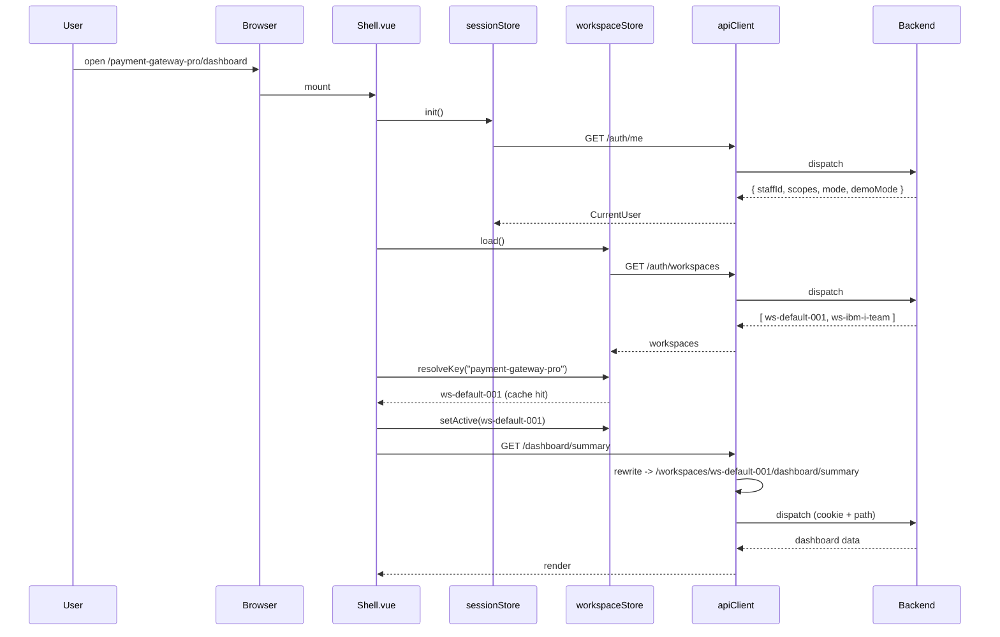
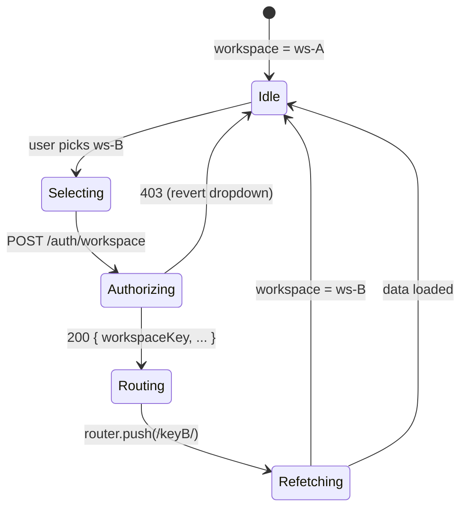
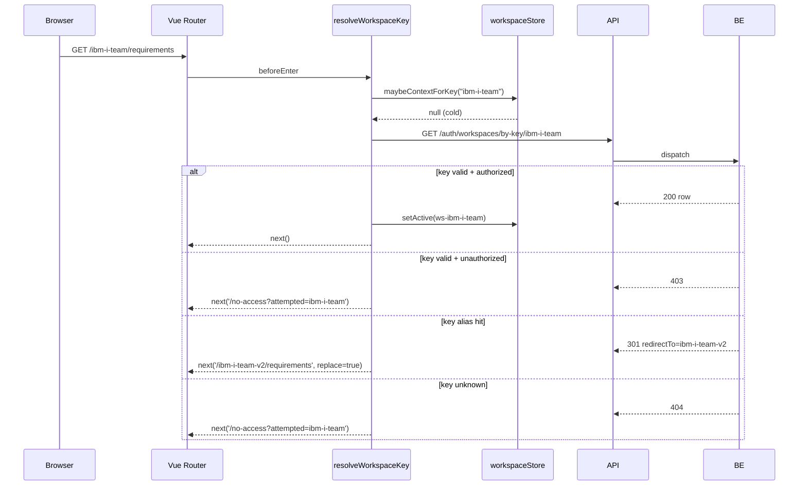
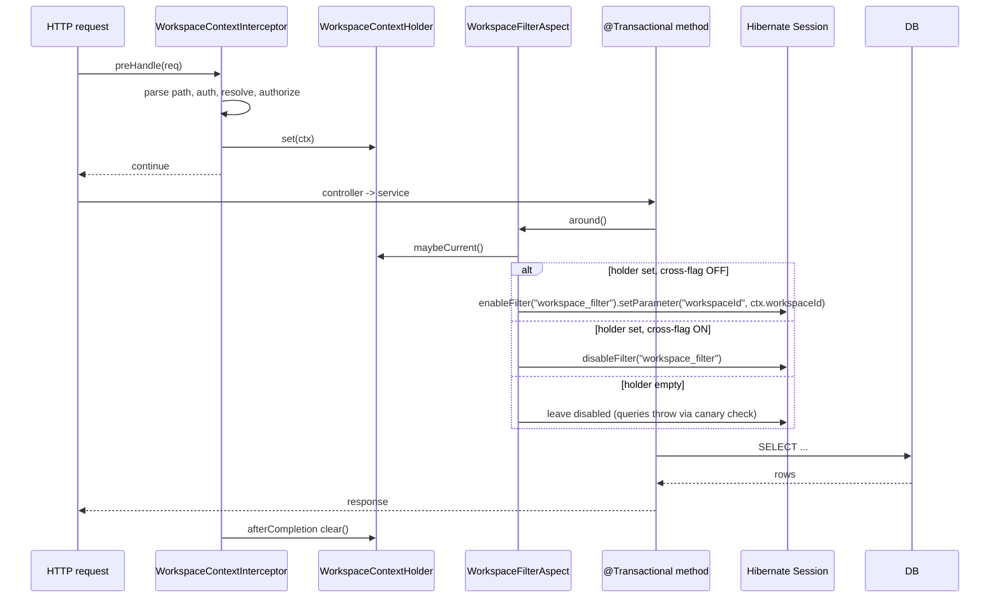
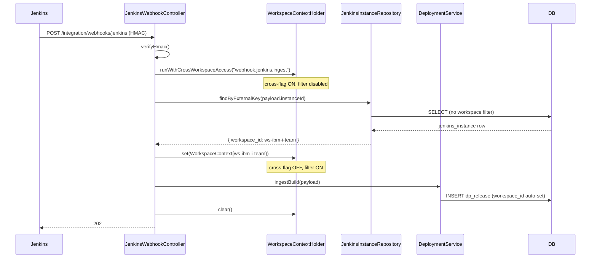
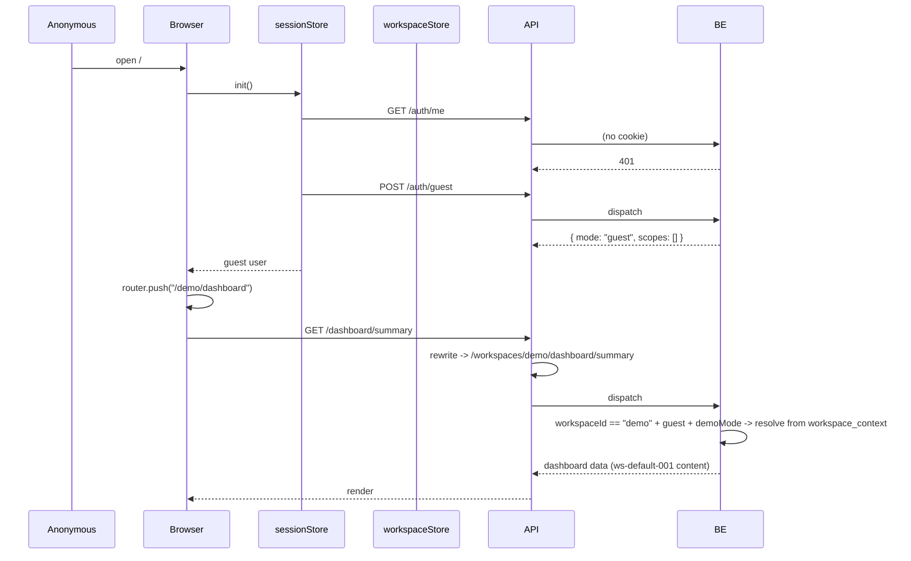
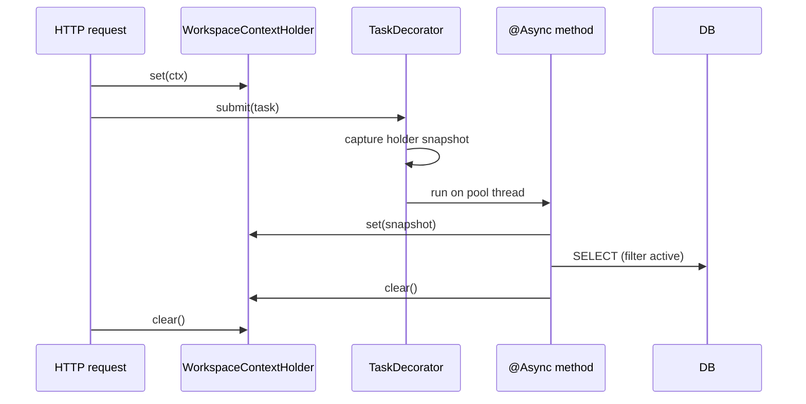

# Multi-Tenancy Foundation Data Flow

## Purpose

Document every runtime data flow that touches the workspace boundary so
implementers (and Codex) have a single reference for the order of
operations, the location of state, and where errors fall.

## Source

- [multi-tenancy-foundation-architecture.md](multi-tenancy-foundation-architecture.md)
- [multi-tenancy-foundation-spec.md](../03-spec/multi-tenancy-foundation-spec.md)

---

## 1. Cold Login → First Page Load



Key invariants:

- `GET /auth/me` and `GET /auth/workspaces` are the **only** un-prefixed
  domain calls before workspace resolution
- After resolution, every domain call carries the path prefix
- A failed `resolveKey` redirects to `/no-access` before any domain call

## 2. Workspace Switch



Sequence detail:

1. User clicks new workspace in `WorkspaceSwitcher`
2. `apiClient.post('/auth/workspace', { workspaceId })` (allowlisted, no
   prefix injection)
3. Backend writes audit `workspace.switch`, sets cookie, returns key
4. Frontend updates `workspaceStore.context`
5. `localStorage.workspace.{staffId}` updated
6. Vue Router `push('/{newKey}/{currentFeature}')`
7. Parent route guard `resolveWorkspaceKey` is a cache hit; sets context
8. Child view re-mounts (router `key` rotation), triggers fresh fetch

## 3. Hard Reload of `/{key}/<feature>`



## 4. Backend Request Lifecycle (filter + holder)



Notes:

- The aspect runs once per `@Transactional` boundary, not per query, so
  the filter persists for the duration of the transaction
- The aspect is idempotent — re-entering a `@Transactional` method does
  not double-toggle the filter
- A canary `@PrePersist` listener fails fast if a workspace-scoped row
  is inserted with a null `workspace_id`

## 5. Webhook Resolution



Failure: if `findByExternalKey` returns nothing → `404` + audit
`webhook.unknown_source`; no domain write occurs.

## 6. Demo / Guest Path



Guards:

- The synthetic `demo` id never exists in `PLATFORM_WORKSPACE`
- A staff user hitting `/api/v1/workspaces/demo/...` gets `403` and
  redirect to their default workspace
- Workspace switcher hidden under `/demo/*`

## 7. Error Cascade

```mermaid
flowchart TD
    REQ[HTTP request] --> ALLOW{allowlisted?}
    ALLOW -- yes --> ALLOWHANDLE[per-path auth]
    ALLOW -- no --> SHAPE{path matches /workspaces/{id}/...?}
    SHAPE -- no --> R404a[404]
    SHAPE -- yes --> COOKIE{has session?}
    COOKIE -- no --> R401[401 AUTH_REQUIRED]
    COOKIE -- yes --> DEMO{demo + guest + demoMode?}
    DEMO -- yes --> RESOLVED[ctx from workspace_context]
    DEMO -- no --> LOOKUP{PLATFORM_WORKSPACE.findById hit?}
    LOOKUP -- no --> R404b[404 WORKSPACE_NOT_FOUND]
    LOOKUP -- yes --> SCOPE{scope match?}
    SCOPE -- no --> R403[403 WORKSPACE_SCOPE_REQUIRED + audit access_denied]
    SCOPE -- yes --> RESOLVED
    RESOLVED --> CTRL[controller]
    CTRL --> ASPECT{filter aspect}
    ASPECT --> RESULT[200 / domain error]
```

## 8. Refresh Strategy

| Cache | TTL | Invalidated by |
|---|---|---|
| `workspaceById` | 60 s | `PLATFORM_WORKSPACE` insert / update / delete |
| `workspaceByKey` | 60 s | same + alias insert |
| `projectToWorkspace` | 60 s | `project` insert / update of `workspace_id` |
| Frontend `workspaceStore.workspaces` | session | login, workspace.switch, manual reload |
| Frontend `localStorage.workspace.{staffId}` | 30 days | switch, logout |

Stale-cache safety: cache hits are validated against the request's
scope at every interceptor pass. A stale row that no longer matches the
user's scopes will fail authorization, not silently authorize.

## 9. Async / Background Tasks

`@Async` methods that read or write workspace-scoped data inherit the
parent request's `WorkspaceContext` via a Spring `TaskDecorator`:



Background scheduled jobs (`@Scheduled`) without a request context must
explicitly call `runWithCrossWorkspaceAccess` for system-wide work, or
loop over `PLATFORM_WORKSPACE` and `set` per workspace for per-tenant work.
