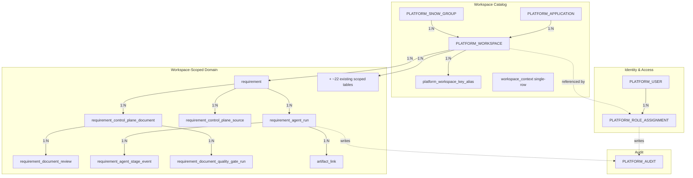

# Multi-Tenancy Foundation Data Model

## Purpose

Define the persistent and runtime data model touched by this slice:
existing tables that gain enforcement, new tables, the ThreadLocal
runtime context, and frontend types.

## Source

- [multi-tenancy-foundation-architecture.md](multi-tenancy-foundation-architecture.md)
- [multi-tenancy-foundation-spec.md](../03-spec/multi-tenancy-foundation-spec.md)
- Existing: V1 / V86 / V90 / V93 / V95

---

## 1. Domain Model Overview



The 7 control-plane tables on the right side currently scope through
`requirement.workspace_id`; this slice denormalizes a `workspace_id`
column directly onto each.

---

## 2. Existing Tables Touched

### `PLATFORM_WORKSPACE` (V86, no schema change here)

```sql
CREATE TABLE PLATFORM_WORKSPACE (
    id              VARCHAR(64) PRIMARY KEY,
    workspace_key   VARCHAR(128) NOT NULL,
    name            VARCHAR(256) NOT NULL,
    application_id  VARCHAR(64) NOT NULL,
    snow_group_id   VARCHAR(64) NOT NULL,
    status          VARCHAR(32) NOT NULL,
    created_at      TIMESTAMP NOT NULL,
    updated_at      TIMESTAMP NOT NULL
);
```

This slice adds a UNIQUE index on `workspace_key` if not present:

```sql
CREATE UNIQUE INDEX ux_platform_workspace_key ON PLATFORM_WORKSPACE(workspace_key);
```

This slice introduces a JPA mapping (`PlatformWorkspaceEntity`) to allow
runtime resolution; the table itself is unchanged.

### `PLATFORM_ROLE_ASSIGNMENT` (V90, no schema change)

Used to compute `currentUser.scopes`. No change. The
`scope_type IN ('platform', 'application', 'snow_group', 'workspace', 'project')`
contract from V90 stays.

### `workspace_context` (V1 + V95, no schema change)

Single-row table. Used **only** by the demo / guest fallback path; no
longer the source of truth for runtime workspace identity.

---

## 3. New Tables (V97-V103)

### V97 — add column

```sql
ALTER TABLE requirement_agent_run                       ADD workspace_id VARCHAR(64);
ALTER TABLE requirement_control_plane_source            ADD workspace_id VARCHAR(64);
ALTER TABLE requirement_control_plane_document          ADD workspace_id VARCHAR(64);
ALTER TABLE requirement_document_review                 ADD workspace_id VARCHAR(64);
ALTER TABLE requirement_agent_stage_event               ADD workspace_id VARCHAR(64);
ALTER TABLE requirement_document_quality_gate_run       ADD workspace_id VARCHAR(64);
ALTER TABLE artifact_link                               ADD workspace_id VARCHAR(64);
```

### V98 — backfill

```sql
UPDATE requirement_agent_run r
   SET workspace_id = (SELECT q.workspace_id FROM requirement q WHERE q.id = r.requirement_id)
 WHERE r.workspace_id IS NULL;

UPDATE requirement_control_plane_source s
   SET workspace_id = (SELECT q.workspace_id FROM requirement q WHERE q.id = s.requirement_id)
 WHERE s.workspace_id IS NULL;

UPDATE requirement_control_plane_document d
   SET workspace_id = (SELECT q.workspace_id FROM requirement q WHERE q.id = d.requirement_id)
 WHERE d.workspace_id IS NULL;

UPDATE requirement_document_review v
   SET workspace_id = (SELECT d.workspace_id FROM requirement_control_plane_document d WHERE d.id = v.document_id)
 WHERE v.workspace_id IS NULL;

UPDATE requirement_agent_stage_event e
   SET workspace_id = (SELECT r.workspace_id FROM requirement_agent_run r WHERE r.execution_id = e.execution_id)
 WHERE e.workspace_id IS NULL;

UPDATE requirement_document_quality_gate_run g
   SET workspace_id = (SELECT d.workspace_id FROM requirement_control_plane_document d WHERE d.id = g.document_id)
 WHERE g.workspace_id IS NULL;

UPDATE artifact_link a
   SET workspace_id = (SELECT r.workspace_id FROM requirement_agent_run r WHERE r.execution_id = a.execution_id)
 WHERE a.workspace_id IS NULL;

-- verification: every table must report 0 here before V99 runs
-- SELECT 'requirement_agent_run' tbl, COUNT(*) FROM requirement_agent_run WHERE workspace_id IS NULL
-- UNION ALL ...;
```

### V99 — enforce + index

```sql
ALTER TABLE requirement_agent_run                ALTER COLUMN workspace_id SET NOT NULL;
ALTER TABLE requirement_control_plane_source     ALTER COLUMN workspace_id SET NOT NULL;
ALTER TABLE requirement_control_plane_document   ALTER COLUMN workspace_id SET NOT NULL;
ALTER TABLE requirement_document_review          ALTER COLUMN workspace_id SET NOT NULL;
ALTER TABLE requirement_agent_stage_event        ALTER COLUMN workspace_id SET NOT NULL;
ALTER TABLE requirement_document_quality_gate_run ALTER COLUMN workspace_id SET NOT NULL;
ALTER TABLE artifact_link                        ALTER COLUMN workspace_id SET NOT NULL;

CREATE INDEX idx_req_agent_run_ws        ON requirement_agent_run(workspace_id, created_at);
CREATE INDEX idx_req_cp_source_ws        ON requirement_control_plane_source(workspace_id, requirement_id);
CREATE INDEX idx_req_cp_document_ws      ON requirement_control_plane_document(workspace_id, requirement_id);
CREATE INDEX idx_req_doc_review_ws       ON requirement_document_review(workspace_id, document_id);
CREATE INDEX idx_req_agent_stage_evt_ws  ON requirement_agent_stage_event(workspace_id, execution_id);
CREATE INDEX idx_req_doc_qgr_ws          ON requirement_document_quality_gate_run(workspace_id, document_id);
CREATE INDEX idx_artifact_link_ws        ON artifact_link(workspace_id, execution_id);
```

### V100 — composite indexes on existing scoped tables

For every existing table that already carries `workspace_id` and lacks
`(workspace_id, …)` index, add one. Concrete list emitted by the
migration generator: `requirement(workspace_id, status)`,
`metric_snapshots(workspace_id, snapshot_at)`, `policy(workspace_id, …)`,
`design_artifact(workspace_id, updated_at)`, `repos(workspace_id, …)`,
`test_plan(workspace_id, …)`, `dp_application(workspace_id, …)`,
`jenkins_instance(workspace_id, …)`, etc.

### V101 — workspace key alias

```sql
CREATE TABLE platform_workspace_key_alias (
    id            BIGINT GENERATED BY DEFAULT AS IDENTITY PRIMARY KEY,
    workspace_id  VARCHAR(64) NOT NULL,
    former_key    VARCHAR(128) NOT NULL,
    expires_at    TIMESTAMP WITH TIME ZONE NOT NULL,
    created_at    TIMESTAMP WITH TIME ZONE NOT NULL,
    CONSTRAINT uq_platform_workspace_key_alias UNIQUE (former_key),
    CONSTRAINT fk_platform_workspace_key_alias FOREIGN KEY (workspace_id) REFERENCES PLATFORM_WORKSPACE(id)
);

CREATE INDEX idx_pwa_expires ON platform_workspace_key_alias(expires_at);
```

### V102 — IBM-i seed

```sql
-- Application
INSERT INTO PLATFORM_APPLICATION (id, app_key, name, owner_snow_group_id, criticality, status, created_at, updated_at)
VALUES ('app-ibmi-core', 'ibmi-core', 'IBM-i Core', 'snow-ibmi-ops', 'critical', 'active', CURRENT_TIMESTAMP, CURRENT_TIMESTAMP);

-- SNOW group
INSERT INTO PLATFORM_SNOW_GROUP (id, servicenow_group_name, display_name, owner_email, escalation_policy, status, created_at, updated_at)
VALUES ('snow-ibmi-ops', 'IBMi-Operations', 'IBM-i Operations', 'ibmi-ops@example.com', 'p1-15min', 'active', CURRENT_TIMESTAMP, CURRENT_TIMESTAMP);

-- Workspace
INSERT INTO PLATFORM_WORKSPACE (id, workspace_key, name, application_id, snow_group_id, status, created_at, updated_at)
VALUES ('ws-ibm-i-team', 'ibm-i-team', 'IBM-i Team', 'app-ibmi-core', 'snow-ibmi-ops', 'active', CURRENT_TIMESTAMP, CURRENT_TIMESTAMP);

-- Existing default workspace also gets a key
UPDATE PLATFORM_WORKSPACE SET workspace_key = 'payment-gateway-pro' WHERE id = 'ws-default-001' AND (workspace_key IS NULL OR workspace_key = '');

-- Staff user
INSERT INTO PLATFORM_USER (staff_id, display_name, staff_name, email, profile_source, status, password_hash, created_at, updated_at)
VALUES ('43929999', 'IBM-i Demo Lead', 'IBM-i Demo Lead', 'ibmi-demo@example.com', 'manual', 'active', NULL, CURRENT_TIMESTAMP, CURRENT_TIMESTAMP);

-- Role grant
INSERT INTO PLATFORM_ROLE_ASSIGNMENT (id, staff_id, user_display_name, role, scope_type, scope_id, granted_by, granted_at)
VALUES ('ra-43929999-member-workspace-ibm-i-team', '43929999', 'IBM-i Demo Lead', 'WORKSPACE_MEMBER', 'workspace', 'ws-ibm-i-team', 'system', CURRENT_TIMESTAMP);

-- Profile binding (links workspace -> ibm-i profile)
INSERT INTO project_sdd_workspace (workspace_id, profile_id, repo_owner, repo_name, branch, created_at, updated_at)
VALUES ('ws-ibm-i-team', 'ibm-i', 'example-org', 'ibmi-core', 'main', CURRENT_TIMESTAMP, CURRENT_TIMESTAMP);

-- Sample requirement at first chain stage
INSERT INTO requirement (id, title, summary, business_justification, priority, status, category, source, completeness_score, created_at, updated_at, workspace_id)
VALUES ('REQ-IBMI-0001', 'Add new column to ORDLOG file for partial shipments', 'Track partial shipments per order line', 'Compliance with new logistics regulation', 'high', 'normalizing', 'enhancement', 'jira', 35, CURRENT_TIMESTAMP, CURRENT_TIMESTAMP, 'ws-ibm-i-team');

-- Sample source reference (Jira)
INSERT INTO requirement_control_plane_source (id, requirement_id, source_type, title, external_url, freshness_status, created_at, updated_at, workspace_id)
VALUES ('src-ibmi-jira-001', 'REQ-IBMI-0001', 'jira', 'IBMI-1234 Partial shipment tracking', 'https://jira.example.com/browse/IBMI-1234', 'FRESH', CURRENT_TIMESTAMP, CURRENT_TIMESTAMP, 'ws-ibm-i-team');
```

### V103 — seed admin scopes for both workspaces

```sql
-- Ensure existing seed admin can view both workspaces (enables the demo switcher)
MERGE INTO PLATFORM_ROLE_ASSIGNMENT
USING (VALUES
    ('ra-seed-admin-member-workspace-ws-default-001', '43920001', 'Seed Admin', 'WORKSPACE_MEMBER', 'workspace', 'ws-default-001', 'system', CURRENT_TIMESTAMP),
    ('ra-seed-admin-member-workspace-ws-ibm-i-team', '43920001', 'Seed Admin', 'WORKSPACE_MEMBER', 'workspace', 'ws-ibm-i-team', 'system', CURRENT_TIMESTAMP)
) src (id, staff_id, user_display_name, role, scope_type, scope_id, granted_by, granted_at)
ON PLATFORM_ROLE_ASSIGNMENT.id = src.id
WHEN NOT MATCHED THEN INSERT (id, staff_id, user_display_name, role, scope_type, scope_id, granted_by, granted_at)
VALUES (src.id, src.staff_id, src.user_display_name, src.role, src.scope_type, src.scope_id, src.granted_by, src.granted_at);
```

> Note: H2 and Oracle both support `MERGE`. If a different upsert idiom
> is preferred for the codebase, use the existing convention.

---

## 4. Runtime Types (Backend)

### `WorkspaceContext` (record)

```java
public record WorkspaceContext(
    String workspaceId,        // ws-default-001
    String workspaceKey,       // payment-gateway-pro
    String workspaceName,      // Payment Gateway Pro
    String applicationId,
    String snowGroupId,
    String profileId,          // standard-java-sdd | ibm-i
    boolean demoMode
) {}
```

### `CurrentUserDto` (existing, extended)

```java
public record CurrentUserDto(
    String mode,               // staff | guest
    String authProvider,
    String staffId,
    String displayName,
    String staffName,
    String avatarUrl,
    List<String> roles,
    Boolean readOnly,
    List<ScopeDto> scopes,     // (scopeType, scopeId)
    boolean demoMode           // ← new: read from AuthProperties
) {}
```

### `WorkspaceListItemDto` (new)

```java
public record WorkspaceListItemDto(
    String workspaceId,
    String workspaceKey,
    String name,
    String applicationId,
    String applicationName,
    String snowGroupId,
    String snowGroupName,
    String profileId
) {}
```

---

## 5. Runtime Types (Frontend)

```ts
export interface Workspace {
  readonly workspaceId: string;
  readonly workspaceKey: string;
  readonly name: string;
  readonly applicationId: string;
  readonly applicationName: string;
  readonly snowGroupId: string;
  readonly snowGroupName: string;
  readonly profileId: string;
}

export interface WorkspaceContextDto {
  readonly workspaceId: string;
  readonly workspaceKey: string;
  readonly workspaceName: string;
  readonly applicationId: string;
  readonly applicationName: string;
  readonly snowGroupId: string;
  readonly snowGroupName: string;
  readonly profileId: string;
  readonly demoMode: boolean;
}

export interface CurrentUser {
  readonly mode: 'staff' | 'guest';
  readonly authProvider: string;
  readonly staffId: string | null;
  readonly displayName: string;
  readonly staffName: string | null;
  readonly avatarUrl: string | null;
  readonly roles: ReadonlyArray<string>;
  readonly readOnly: boolean;
  readonly scopes: ReadonlyArray<{ scopeType: string; scopeId: string }>;
  readonly demoMode: boolean;
}
```

---

## 6. Type Mapping (Frontend ↔ Backend ↔ DB)

| Frontend type | Backend DTO | DB source |
|---|---|---|
| `Workspace` | `WorkspaceListItemDto` | `PLATFORM_WORKSPACE` join `PLATFORM_APPLICATION` join `PLATFORM_SNOW_GROUP` join `project_sdd_workspace` |
| `WorkspaceContextDto` | `WorkspaceContextDto` | same + `AuthProperties.demoMode` |
| `CurrentUser` | `CurrentUserDto` | `PLATFORM_USER` + `PLATFORM_ROLE_ASSIGNMENT` |
| `CurrentUser.scopes[]` | `ScopeDto[]` | `PLATFORM_ROLE_ASSIGNMENT` rows for staffId |

---

## 7. Audit Payload Shapes

`workspace.switch`:

```json
{
  "before": "ws-default-001",
  "after": "ws-ibm-i-team",
  "source": "ui-switcher"
}
```

`workspace.access_denied`:

```json
{
  "claimedWorkspaceId": "ws-ibm-i-team",
  "userScopes": [{ "scopeType": "workspace", "scopeId": "ws-default-001" }],
  "reason": "no_matching_scope"
}
```

`workspace.cross.access` (logged, not persisted as audit row):

```
INFO  workspace.cross.access reason=webhook.jenkins.ingest staffId=system from=none
```

---

## 8. Constraints and Invariants

- `workspace_id` columns are `VARCHAR(64) NOT NULL` after V99
- All inserts on workspace-scoped tables go through code paths that read
  `WorkspaceContextHolder.current().workspaceId`; a `@PrePersist` canary
  asserts the column is populated
- `PLATFORM_WORKSPACE.workspace_key` is unique and immutable from the
  application's perspective; renaming requires inserting a row in
  `platform_workspace_key_alias` with `expires_at = now() + 30 days`
- `platform_workspace_key_alias.former_key` is unique to prevent
  ambiguous redirects
- `WorkspaceContextHolder` is cleared in every `afterCompletion` and at
  the end of every async task to prevent context leak across requests
