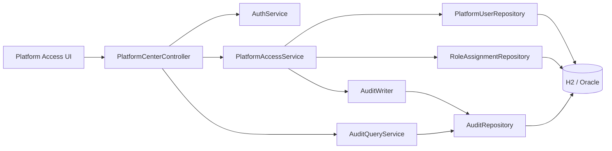
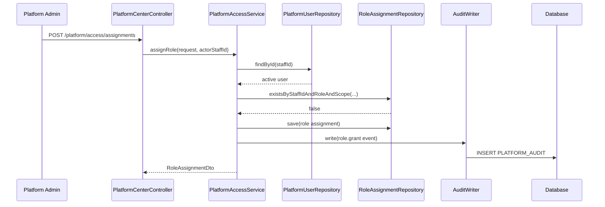
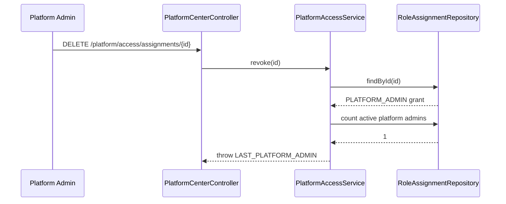

# Platform Access + Audit Persistence Architecture

## Context

The current Platform Center backend exposes access APIs but stores users and role
assignments in memory. This milestone replaces that transient state with JPA
repositories and uses the existing `PLATFORM_AUDIT` table as the durable
governance trail.

## Components



## Package Layout

This increment keeps the existing controller location and adds persistence
support under `backend/src/main/java/com/sdlctower/platform/`:

```text
platform/access/
  PlatformAccessService.java
  PlatformUserDto.java
  RoleAssignmentDto.java
  AssignRoleRequest.java
  UpsertPlatformUserRequest.java
  PlatformUserEntity.java
  RoleAssignmentEntity.java
  PlatformUserRepository.java
  RoleAssignmentRepository.java

platform/audit/
  AuditEvent.java
  AuditRecordEntity.java
  AuditRepository.java
  AuditWriter.java
  AuditQueryService.java
```

If the implementation chooses sub-packages (`entity`, `repository`, `service`),
the public controller/API behavior stays unchanged.

## Data Flow: Assign Role



The role row and audit row are committed or rolled back together.

## Data Flow: Revoke Last Admin



No delete and no success audit row occur on the rejected path.

## Transaction Boundary

Access mutation service methods are `@Transactional`. `AuditWriter.write` uses
mandatory transaction propagation. This prevents accidental audit rows from
committing independently of the protected mutation.

## Migration Usage

The existing migrations define:

- `V89__create_platform_audit.sql`
- `V90__create_platform_user_and_role_assignment.sql`
- `V93__seed_platform_center_data.sql`

This milestone should reuse or minimally amend those migrations only if the live
schema lacks required columns from the data-model document. Do not introduce
duplicate platform access tables.

## Security Notes

- `password_hash` may remain null for local/dev users if the current auth flow
  does not validate hashes.
- The API must never return password hashes.
- Audit payloads must not include plaintext credentials or passwords.
