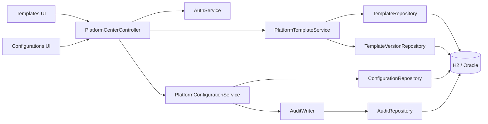
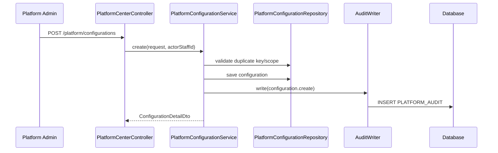

# Platform Configuration Persistence Architecture

## Context

Platform Center already has Flyway tables for templates, template versions, and
configurations. Before this milestone, the controller read static rows from
`PlatformCatalogService`. This increment adds JPA repositories and focused
services for the template/configuration governance surface.

## Components



## Package Layout

```text
platform/template/
  PlatformTemplateEntity.java
  PlatformTemplateVersionEntity.java
  PlatformTemplateRepository.java
  PlatformTemplateVersionRepository.java
  PlatformTemplateService.java
  TemplateSummaryDto.java
  TemplateVersionDto.java
  TemplateDetailDto.java
  InheritanceFieldDto.java

platform/configuration/
  PlatformConfigurationEntity.java
  PlatformConfigurationRepository.java
  PlatformConfigurationService.java
  ConfigurationSummaryDto.java
  ConfigurationDetailDto.java
  UpsertConfigurationRequest.java
  PlatformConfigurationException.java
```

The controller remains in `platform/admin` to keep the public Platform Center
API surface stable.

## Data Flow: Create Configuration Override



The configuration row and audit row are committed or rolled back together.

## Drift Computation

Configuration detail compares the selected JSON object to the platform-default
JSON object with the same key. The V1 drift algorithm is intentionally simple:

- parse both bodies as JSON objects
- collect top-level keys from both objects
- include a key when selected value and platform value differ
- `hasDrift = driftFields` is not empty

Nested semantic diff and schema validation are deferred.

## Migration Usage

This milestone reuses existing migrations:

- `V87__create_platform_template.sql`
- `V88__create_platform_configuration.sql`
- `V93__seed_platform_center_data.sql`

Do not introduce duplicate template or configuration tables.

## Security Notes

- Configuration bodies are generic JSON but must not include plaintext secrets.
- Credential references belong to integration/vault tables, not configuration
  bodies.
- Audit payloads include before/after snapshots and request metadata only.
