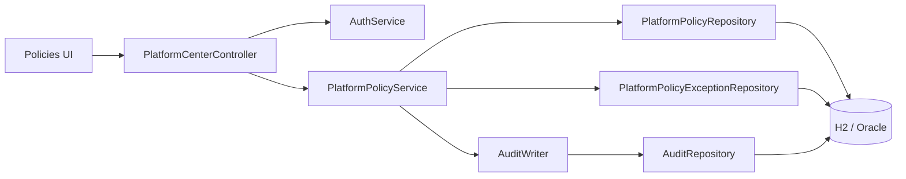
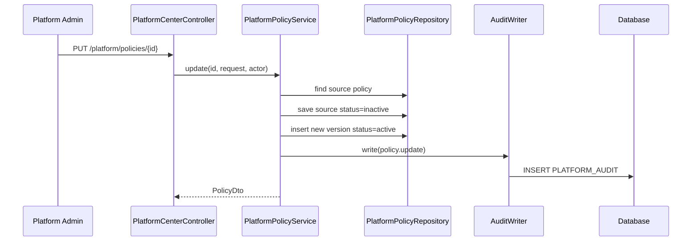
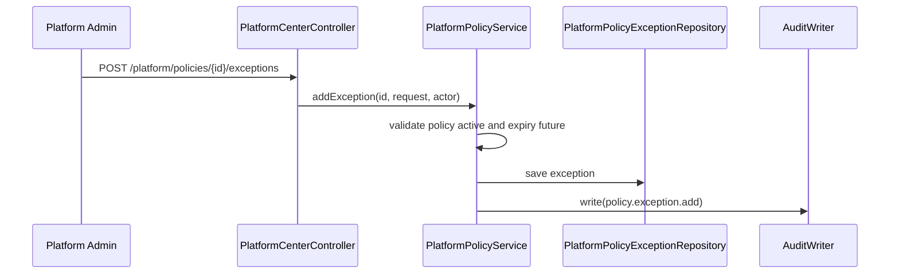

# Platform Policy Persistence Architecture

## Context

Platform Center already has Flyway tables for policies and policy exceptions,
but the controller currently reads static catalog rows. This milestone adds
repository-backed policy services and audited write paths.

## Components



## Package Layout

```text
platform/policy/
  PlatformPolicyEntity.java
  PlatformPolicyExceptionEntity.java
  PlatformPolicyRepository.java
  PlatformPolicyExceptionRepository.java
  PlatformPolicyService.java
  PolicyDto.java
  PolicyExceptionDto.java
  UpsertPolicyRequest.java
  CreatePolicyExceptionRequest.java
  PlatformPolicyException.java
```

## Data Flow: Edit Policy



The source row transition, new version insert, and audit row commit or roll back
together.

## Data Flow: Add Exception



## Migration Usage

This milestone reuses existing migrations:

- `V91__create_platform_policy.sql`
- `V93__seed_platform_center_data.sql`

Do not introduce duplicate policy tables.

## Security Notes

- Policy bodies are generic JSON but must not contain plaintext secrets.
- Exceptions include human-entered reasons and should be treated as audit
  evidence.
- Runtime policy enforcement remains in consumer slices.
