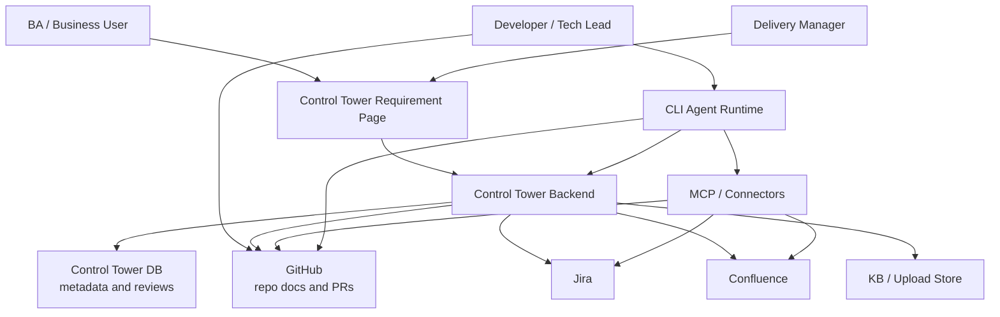
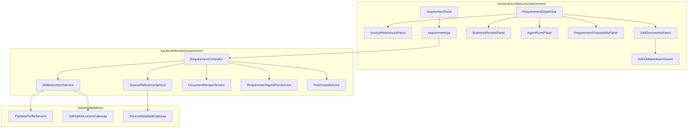
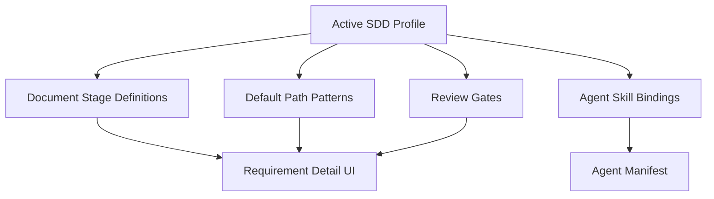
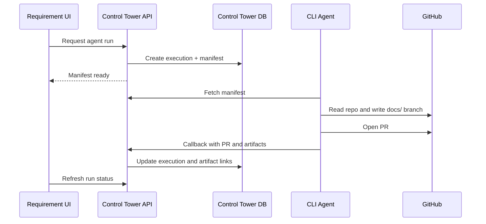

# Requirement Control Plane Architecture

## Overview

Requirement Control Plane extends the Requirement Management slice with a
platform-oriented architecture:

- External BAU systems provide business source references
- GitHub `docs/` provides SDD document content and version history
- Control Tower indexes metadata, renders documents, records reviews, creates
  agent manifests, and reports freshness
- CLI agents perform repo-aware and long-running work

## System Context



## Component Architecture



## Backend Package Boundaries

Requirement-specific services own requirement-linked source references,
document indexes, reviews, manifests, and freshness projections. Provider-specific
logic should live behind platform gateways or agent runtime connectors.

Suggested packages:

```text
com.sdlctower.domain.requirement.source
com.sdlctower.domain.requirement.document
com.sdlctower.domain.requirement.review
com.sdlctower.domain.requirement.agent
com.sdlctower.domain.requirement.freshness
com.sdlctower.platform.github
com.sdlctower.platform.source
```

## Data Ownership

| Data | Owner | Notes |
|---|---|---|
| Jira / Confluence body | Source system | Referenced and optionally summarized, not copied as source of truth |
| SDD Markdown body | GitHub | Fetched on open |
| Source reference metadata | Control Tower DB | URL, external ID, source updated time, fetched time |
| Document index metadata | Control Tower DB | repo/path/ref/SHA/status/profile |
| Business comments and approvals | Control Tower DB | version-bound |
| Engineering review | GitHub | PR review and diff |
| Agent execution manifest | Control Tower DB | Context handoff |
| Agent outputs | GitHub plus Control Tower artifact links | PRs, docs, reports |

## Profile-Driven Rendering



## Agent Boundary

Control Tower creates the manifest and records status. Agents execute outside
the web app.



## Freshness Strategy

Freshness is computed as a projection, not as a replacement for external
systems. The first implementation can compare timestamps and Git blob versions:

- `sourceUpdatedAt > documentCommitTime` means Source Changed
- `documentBlobSha != reviewedBlobSha` means Document Changed After Review
- Missing indexed document for expected profile stage means Missing Document
- Missing source for requirement means Missing Source

## Integration Risks

| Risk | Mitigation |
|---|---|
| Provider metadata differs across Jira/Confluence | Store generic metadata plus provider payload summary |
| GitHub fetch latency | Lazy fetch document content; keep metadata list fast |
| Business comments drift after doc change | Bind comments to commit/blob |
| IBM i stages do not match Java SDD | Use profile-defined stages |
| Agent executes against wrong context | Manifest pinning and stale-context callback |

