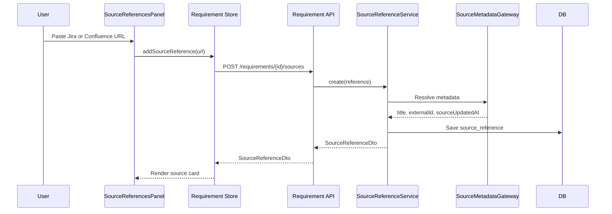
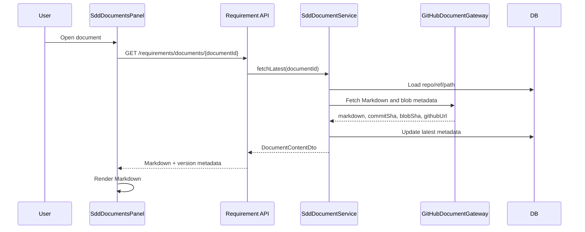
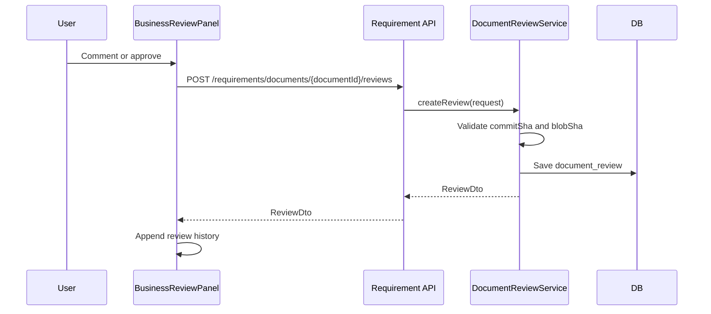
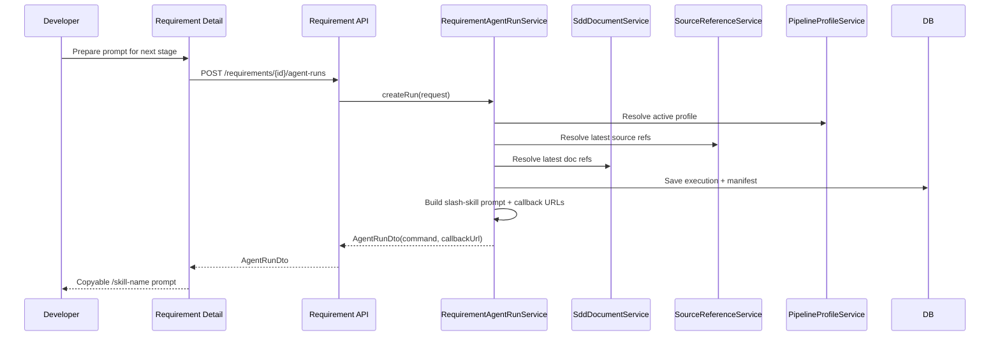
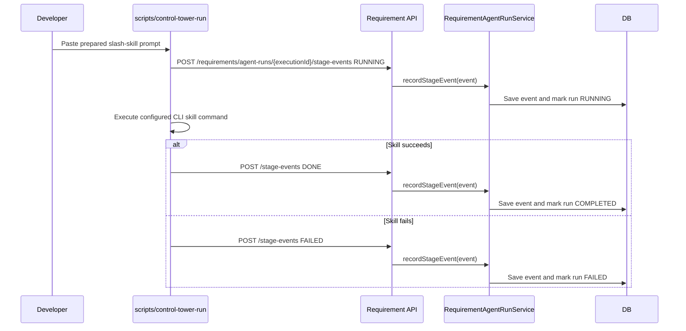
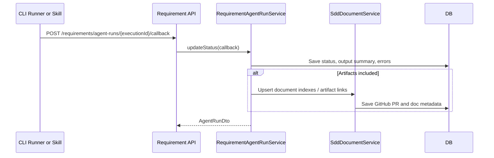
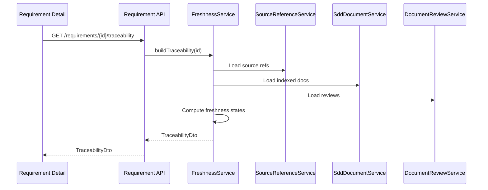
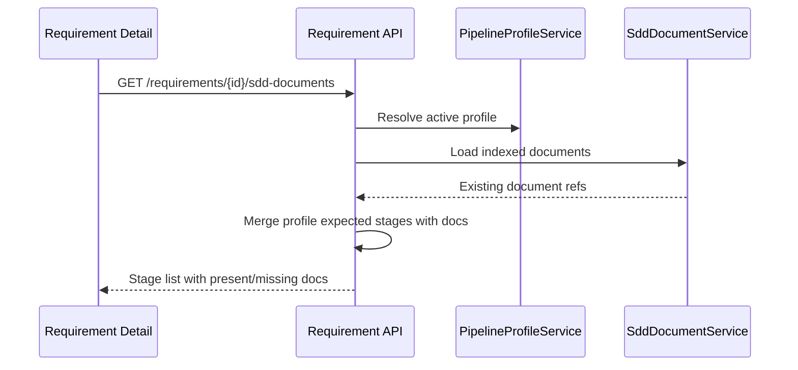

# Requirement Control Plane Data Flow

## Purpose

This document describes runtime data flows for Requirement Control Plane:
source intake, GitHub document rendering, business review, agent manifest
creation, manual CLI handoff, agent stage callbacks, final agent callback, and
freshness refresh.

## 1. Source Reference Intake

Error behavior:

- If metadata cannot be fetched, store the URL with `status=ERROR`.
- UI shows retry action.
- Requirement detail continues rendering.

## 2. Open Latest GitHub SDD Document

Rules:

- Markdown body is fetched from GitHub.
- Control Tower may update index metadata after fetch.
- The fetched content is not canonical storage in Control Tower.

## 3. Business Review

Rules:

- Review requests must include commit SHA and blob SHA.
- Approval becomes stale if the document blob changes later.

## 4. Agent Run Request and Manual CLI Prompt Handoff

The manifest pins resolved versions at creation time. In the short-term model,
the UI does not execute the CLI directly. It prepares the run and shows the
actual prompt a user should paste into their agent terminal, for example
`/ibm-i-workflow-orchestrator please help me complete Program Spec for
REQ-1024.` Callback URLs and run IDs remain in the manifest/API response for
the CLI integration layer and should not be exposed as copy text by default.

## 5. CLI Agent Stage Events

Stage events are lightweight facts from the runner. They answer "where is this
requirement now?" without requiring the UI to infer progress from generated
files only.

Supported stage event statuses:

- STARTED
- RUNNING
- DONE
- FAILED

## 6. CLI Agent Final Callback

Supported callback statuses:

- RUNNING
- COMPLETED
- FAILED
- STALE_CONTEXT
- CANCELED

The callback may include artifact links and may also include embedded
stageEvents when a runner batches progress updates with its final result.

## 7. Freshness Refresh

Freshness states:

- FRESH
- SOURCE_CHANGED
- DOCUMENT_CHANGED_AFTER_REVIEW
- MISSING_DOCUMENT
- MISSING_SOURCE
- UNKNOWN
- ERROR

## 8. Profile-Driven Document Rendering

The UI renders missing expected documents rather than hiding gaps.
