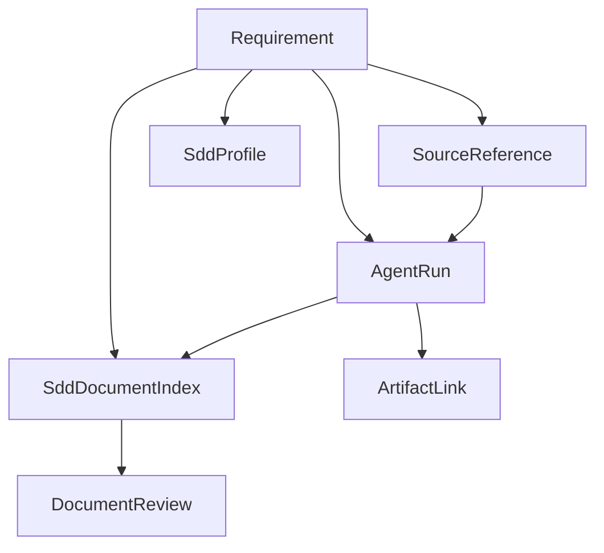

# Requirement Control Plane Data Model

## Purpose

This document defines the data model for Requirement Control Plane. It focuses
on generic, reusable platform primitives rather than Java-specific SDD tables.

## Domain Overview



## Core Entities

### SourceReference

Represents a BAU source linked to a requirement.

| Field | Type | Notes |
|---|---|---|
| id | string | UUID |
| requirementId | string | Requirement ID |
| sourceType | enum | JIRA, CONFLUENCE, UPLOAD, KB, GITHUB, URL |
| externalId | string | Provider ID when available |
| title | string | Display title |
| url | string | External URL |
| sourceUpdatedAt | instant | Optional provider update time |
| fetchedAt | instant | Last metadata fetch |
| versionKey | string | Provider version, checksum, or ETag |
| freshnessStatus | enum | FRESH, SOURCE_CHANGED, UNKNOWN, ERROR |
| errorMessage | string | Optional |

### SddDocumentIndex

Represents an SDD document stored in GitHub.

| Field | Type | Notes |
|---|---|---|
| id | string | UUID |
| requirementId | string | Requirement ID |
| profileId | string | SDD profile |
| sddType | string | Profile-defined stage key |
| title | string | Display title |
| repoFullName | string | owner/repo |
| branchOrRef | string | main, branch, tag, or SHA |
| path | string | GitHub path under docs/ |
| latestCommitSha | string | Last resolved commit |
| latestBlobSha | string | Last resolved blob |
| githubUrl | string | Browser URL |
| status | enum | DRAFT, IN_REVIEW, APPROVED, SUPERSEDED, MISSING |
| lastFetchedAt | instant | Last GitHub metadata fetch |

### DocumentReview

Represents a business review action.

| Field | Type | Notes |
|---|---|---|
| id | string | UUID |
| documentId | string | SddDocumentIndex ID |
| requirementId | string | Denormalized for query |
| decision | enum | COMMENT, APPROVED, CHANGES_REQUESTED, REJECTED |
| comment | string | Optional for approvals |
| reviewerId | string | User ID |
| reviewerType | enum | BUSINESS, TECHNICAL, SECURITY |
| commitSha | string | Reviewed commit |
| blobSha | string | Reviewed blob |
| anchorType | enum | DOCUMENT, HEADING, LINE |
| anchorValue | string | Optional |
| createdAt | instant | Timestamp |

### AgentRun

Represents a CLI-agent execution request and status.

| Field | Type | Notes |
|---|---|---|
| executionId | string | Stable execution ID |
| requirementId | string | Requirement ID |
| profileId | string | Active SDD profile |
| skillKey | string | Profile skill binding |
| status | enum | REQUESTED, MANIFEST_READY, RUNNING, COMPLETED, FAILED, STALE_CONTEXT, CANCELED |
| manifestJson | clob/json | Pinned execution context |
| inputSummaryJson | clob/json | Human-readable source summary |
| outputSummaryJson | clob/json | Agent summary |
| errorMessage | string | Optional |
| requestedBy | string | User ID |
| startedAt | instant | Optional |
| endedAt | instant | Optional |
| createdAt | instant | Timestamp |

### ArtifactLink

Represents an output artifact from an agent run.

| Field | Type | Notes |
|---|---|---|
| id | string | UUID |
| executionId | string | AgentRun ID |
| artifactType | enum | GITHUB_DOC, GITHUB_PR, REPORT, REVIEW_REPORT, CODE_PATCH, TEST_OUTPUT |
| storageType | enum | GITHUB, KB, OBJECT_STORE, URL |
| title | string | Display title |
| uri | string | Link |
| repoFullName | string | Optional |
| path | string | Optional |
| commitSha | string | Optional |
| blobSha | string | Optional |
| status | enum | DRAFT, IN_REVIEW, APPROVED, GENERATED |
| createdAt | instant | Timestamp |

## Frontend Types

```ts
export type SourceType = 'JIRA' | 'CONFLUENCE' | 'UPLOAD' | 'KB' | 'GITHUB' | 'URL';
export type FreshnessStatus =
  | 'FRESH'
  | 'SOURCE_CHANGED'
  | 'DOCUMENT_CHANGED_AFTER_REVIEW'
  | 'MISSING_DOCUMENT'
  | 'MISSING_SOURCE'
  | 'UNKNOWN'
  | 'ERROR';

export interface SourceReference {
  readonly id: string;
  readonly requirementId: string;
  readonly sourceType: SourceType;
  readonly externalId: string | null;
  readonly title: string;
  readonly url: string;
  readonly sourceUpdatedAt: string | null;
  readonly fetchedAt: string | null;
  readonly freshnessStatus: FreshnessStatus;
  readonly errorMessage?: string | null;
}

export interface SddDocumentIndex {
  readonly id: string;
  readonly requirementId: string;
  readonly profileId: string;
  readonly sddType: string;
  readonly stageLabel: string;
  readonly title: string;
  readonly repoFullName: string;
  readonly branchOrRef: string;
  readonly path: string;
  readonly latestCommitSha: string | null;
  readonly latestBlobSha: string | null;
  readonly githubUrl: string | null;
  readonly status: string;
  readonly freshnessStatus: FreshnessStatus;
  readonly missing: boolean;
}

export interface DocumentContent {
  readonly document: SddDocumentIndex;
  readonly markdown: string;
  readonly commitSha: string;
  readonly blobSha: string;
  readonly githubUrl: string;
  readonly fetchedAt: string;
}

export interface DocumentReview {
  readonly id: string;
  readonly documentId: string;
  readonly decision: 'COMMENT' | 'APPROVED' | 'CHANGES_REQUESTED' | 'REJECTED';
  readonly comment: string | null;
  readonly reviewerId: string;
  readonly reviewerType: 'BUSINESS' | 'TECHNICAL' | 'SECURITY';
  readonly commitSha: string;
  readonly blobSha: string;
  readonly createdAt: string;
}
```

## Database Tables

Suggested Flyway tables:

```sql
create table requirement_source_reference (
  id varchar(64) primary key,
  requirement_id varchar(32) not null,
  source_type varchar(32) not null,
  external_id varchar(255),
  title varchar(512) not null,
  url varchar(2048) not null,
  source_updated_at timestamp,
  fetched_at timestamp,
  version_key varchar(255),
  freshness_status varchar(64) not null,
  error_message varchar(1024)
);

create table requirement_sdd_document_index (
  id varchar(64) primary key,
  requirement_id varchar(32) not null,
  profile_id varchar(128) not null,
  sdd_type varchar(128) not null,
  title varchar(512) not null,
  repo_full_name varchar(255) not null,
  branch_or_ref varchar(255) not null,
  path varchar(1024) not null,
  latest_commit_sha varchar(64),
  latest_blob_sha varchar(64),
  github_url varchar(2048),
  status varchar(64) not null,
  last_fetched_at timestamp
);

create table requirement_document_review (
  id varchar(64) primary key,
  document_id varchar(64) not null,
  requirement_id varchar(32) not null,
  decision varchar(64) not null,
  comment_text clob,
  reviewer_id varchar(128) not null,
  reviewer_type varchar(64) not null,
  commit_sha varchar(64) not null,
  blob_sha varchar(64) not null,
  anchor_type varchar(32),
  anchor_value varchar(512),
  created_at timestamp not null
);

create table requirement_agent_run (
  execution_id varchar(64) primary key,
  requirement_id varchar(32) not null,
  profile_id varchar(128) not null,
  skill_key varchar(255) not null,
  status varchar(64) not null,
  manifest_json clob not null,
  input_summary_json clob,
  output_summary_json clob,
  error_message varchar(2048),
  requested_by varchar(128) not null,
  started_at timestamp,
  ended_at timestamp,
  created_at timestamp not null
);

create table requirement_artifact_link (
  id varchar(64) primary key,
  execution_id varchar(64) not null,
  artifact_type varchar(64) not null,
  storage_type varchar(64) not null,
  title varchar(512) not null,
  uri varchar(2048) not null,
  repo_full_name varchar(255),
  path varchar(1024),
  commit_sha varchar(64),
  blob_sha varchar(64),
  status varchar(64) not null,
  created_at timestamp not null
);
```

## Compatibility Notes

- Existing `requirement`, `user_story`, and `requirement_spec` tables remain.
- Existing `requirement_sdlc_chain_link` can continue serving legacy chain views
  but should not be the only representation for GitHub SDD docs.
- `RequirementImportTask` remains useful for KB-backed source ingestion.
- New tables are additive.

