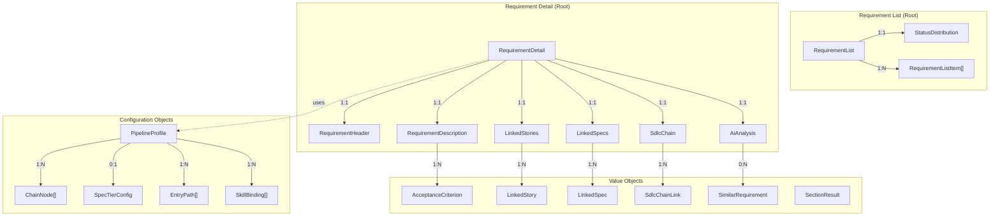
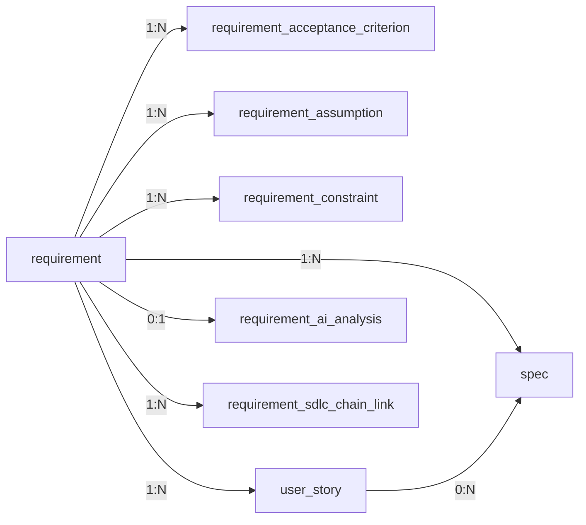

# Requirement Data Model

## Purpose

This document defines the domain and persistent data model for the Requirement Management
page -- covering frontend types, backend DTOs, and the database schema. The Requirement
Management page is the entry point of the Spec Driven Development (SDD) chain and manages
three core domain objects: **Requirement**, **User Story**, and **Spec**, plus supporting
objects for AI analysis and SDLC chain traceability.

## Traceability

- Requirements: [requirement-requirements.md](../01-requirements/requirement-requirements.md)
- Architecture: [requirement-architecture.md](requirement-architecture.md)
- Design: [requirement-design.md](../05-design/requirement-design.md)
- Spec: [requirement-spec.md](../03-spec/requirement-spec.md)
- Types source: `frontend/src/features/requirement/types/requirement.ts`

---

## 1. Domain Model Overview



---

## 2. Frontend Type Model

All types are defined in `frontend/src/features/requirement/types/requirement.ts`.
All interfaces use `readonly` properties for immutability.

### 2.1 Envelope Types

| Type | Purpose | Fields |
|------|---------|--------|
| `SectionResult<T>` | Per-section error isolation (shared) | `data: T \| null`, `error: string \| null` |

> Re-exported from `@/shared/types/section`.

### 2.2 Enums / Union Types

| Type | Values |
|------|--------|
| `RequirementPriority` | `'CRITICAL' \| 'HIGH' \| 'MEDIUM' \| 'LOW'` |
| `RequirementStatus` | `'DRAFT' \| 'IN_REVIEW' \| 'APPROVED' \| 'IN_PROGRESS' \| 'DELIVERED' \| 'ARCHIVED'` |
| `RequirementCategory` | `'FUNCTIONAL' \| 'NON_FUNCTIONAL' \| 'TECHNICAL' \| 'BUSINESS'` |
| `StoryStatus` | `'DRAFT' \| 'READY' \| 'IN_PROGRESS' \| 'DONE'` |
| `SpecStatus` | `'DRAFT' \| 'IN_REVIEW' \| 'APPROVED' \| 'IMPLEMENTED' \| 'VERIFIED' \| 'SUPERSEDED'` |
| `SpecType` | `'FUNCTIONAL' \| 'API_CONTRACT' \| 'DATA_MODEL' \| 'STATE_MACHINE'` |
| `ViewMode` | `'LIST' \| 'KANBAN' \| 'MATRIX'` |
| `SortField` | `'PRIORITY' \| 'STATUS' \| 'UPDATED' \| 'CREATED'` |
| `SdlcArtifactType` | `'requirement' \| 'spec' \| 'design' \| 'code' \| 'test' \| 'deploy'` (shared) |

### 2.3 List Types

| Type | Purpose | Key Fields |
|------|---------|------------|
| `RequirementListItem` | Single row in list/kanban | `id`, `title`, `priority`, `status`, `category`, `storyCount`, `specCount`, `completenessScore`, `assignee`, `updatedAt`, `createdAt` |
| `RequirementFilters` | Filter + sort state | `status?`, `priority?`, `category?`, `search`, `sortBy`, `sortDirection` |
| `RequirementList` | List API response payload | `items: RequirementListItem[]`, `statusDistribution`, `totalCount` |

**StatusDistribution** maps each `RequirementStatus` value to a count.

### 2.4 Detail Types

| Type | Purpose | Key Fields |
|------|---------|------------|
| `RequirementHeader` | Header card data | `id`, `title`, `priority`, `status`, `category`, `assignee`, `reporter`, `createdAt`, `updatedAt`, `workspaceId`, `projectId` |
| `RequirementDescription` | Body / business context | `summary`, `businessJustification`, `acceptanceCriteria: AcceptanceCriterion[]`, `assumptions: string[]`, `constraints: string[]` |
| `AcceptanceCriterion` | Single AC item | `id`, `description`, `verified` |
| `LinkedStory` | Derived user story reference | `id`, `title`, `status`, `storyPoints` |
| `LinkedSpec` | Linked spec reference | `id`, `title`, `type`, `status`, `version` |
| `AiAnalysis` | AI-generated analysis | `qualityScore`, `qualityBreakdown`, `suggestions`, `duplicateCheck`, `impactAnalysis`, `analyzedAt` |
| `SimilarRequirement` | Similar item reference | `id`, `title`, `similarity` |
| `SdlcChainLink` | Single chain link (shared) | `artifactType`, `artifactId`, `artifactTitle`, `routePath` |

### 2.5 Aggregate Types

| Type | Purpose | Key Fields |
|------|---------|------------|
| `RequirementList` | List API response payload | `items: RequirementListItem[]`, `statusDistribution: Record<RequirementStatus, number>`, `totalCount: number` |
| `RequirementDetail` | Detail API response payload | `header: SectionResult<RequirementHeader>`, `description: SectionResult<RequirementDescription>`, `stories: SectionResult<LinkedStory[]>`, `specs: SectionResult<LinkedSpec[]>`, `chain: SectionResult<SdlcChainLink[]>`, `analysis: SectionResult<AiAnalysis>` |

### 2.6 Full Type Definitions

```typescript
import type { SectionResult } from '@/shared/types/section';

export type { SectionResult };

// ── Enums / Union Types ──

export type RequirementPriority = 'CRITICAL' | 'HIGH' | 'MEDIUM' | 'LOW';

export type RequirementStatus =
  | 'DRAFT'
  | 'IN_REVIEW'
  | 'APPROVED'
  | 'IN_PROGRESS'
  | 'DELIVERED'
  | 'ARCHIVED';

export type RequirementCategory =
  | 'FUNCTIONAL'
  | 'NON_FUNCTIONAL'
  | 'TECHNICAL'
  | 'BUSINESS';

export type StoryStatus = 'DRAFT' | 'READY' | 'IN_PROGRESS' | 'DONE';

export type SpecStatus = 'DRAFT' | 'IN_REVIEW' | 'APPROVED' | 'IMPLEMENTED' | 'VERIFIED' | 'SUPERSEDED';

export type SpecType = 'FUNCTIONAL' | 'API_CONTRACT' | 'DATA_MODEL' | 'STATE_MACHINE';

export type ViewMode = 'LIST' | 'KANBAN' | 'MATRIX';

export type RequirementSortField = 'PRIORITY' | 'STATUS' | 'UPDATED' | 'CREATED';

export type SdlcArtifactType = 'requirement' | 'spec' | 'design' | 'code' | 'test' | 'deploy';

// ── List Types ──

export interface RequirementListItem {
  readonly id: string;
  readonly title: string;
  readonly priority: RequirementPriority;
  readonly status: RequirementStatus;
  readonly category: RequirementCategory;
  readonly storyCount: number;
  readonly specCount: number;
  readonly completenessScore: number;  // 0-100, from AI analysis
  readonly assignee: string | null;
  readonly updatedAt: string;
  readonly createdAt: string;
}

export interface RequirementFilters {
  readonly status: RequirementStatus | null;
  readonly priority: RequirementPriority | null;
  readonly category: RequirementCategory | null;
  readonly search: string;
  readonly sortBy: RequirementSortField;
  readonly sortDirection: 'asc' | 'desc';
}

export interface RequirementList {
  readonly items: ReadonlyArray<RequirementListItem>;
  readonly statusDistribution: Readonly<Record<RequirementStatus, number>>;
  readonly totalCount: number;
}

// ── Detail Types ──

export interface RequirementHeader {
  readonly id: string;
  readonly title: string;
  readonly priority: RequirementPriority;
  readonly status: RequirementStatus;
  readonly category: RequirementCategory;
  readonly assignee: string | null;
  readonly reporter: string;
  readonly createdAt: string;
  readonly updatedAt: string;
  readonly workspaceId: string;
  readonly projectId: string;
}

export interface AcceptanceCriterion {
  readonly id: string;
  readonly description: string;
  readonly verified: boolean;
}

export interface RequirementDescription {
  readonly summary: string;
  readonly businessJustification: string;
  readonly acceptanceCriteria: ReadonlyArray<AcceptanceCriterion>;
  readonly assumptions: ReadonlyArray<string>;
  readonly constraints: ReadonlyArray<string>;
}

export interface LinkedStory {
  readonly id: string;
  readonly title: string;
  readonly status: StoryStatus;
  readonly storyPoints: number | null;
}

export interface LinkedSpec {
  readonly id: string;
  readonly title: string;
  readonly type: SpecType;
  readonly status: SpecStatus;
  readonly version: string;
}

export interface SimilarRequirement {
  readonly id: string;
  readonly title: string;
  readonly similarity: number;  // 0.0-1.0
}

export interface QualityBreakdown {
  readonly completeness: number;   // 0-100
  readonly clarity: number;        // 0-100
  readonly testability: number;    // 0-100
  readonly consistency: number;    // 0-100
}

export interface AiSuggestion {
  readonly type: 'AMBIGUITY' | 'GAP' | 'INCONSISTENCY' | 'IMPROVEMENT';
  readonly severity: 'HIGH' | 'MEDIUM' | 'LOW';
  readonly message: string;
  readonly field: string;
}

export interface DuplicateCheck {
  readonly hasPotentialDuplicates: boolean;
  readonly candidates: ReadonlyArray<SimilarRequirement>;
}

export interface ImpactAnalysis {
  readonly downstreamArtifacts: number;
  readonly affectedTeams: ReadonlyArray<string>;
  readonly riskLevel: 'HIGH' | 'MEDIUM' | 'LOW';
}

export interface AiAnalysis {
  readonly qualityScore: number;   // 0-100
  readonly qualityBreakdown: QualityBreakdown;
  readonly suggestions: ReadonlyArray<AiSuggestion>;
  readonly duplicateCheck: DuplicateCheck;
  readonly impactAnalysis: ImpactAnalysis;
  readonly analyzedAt: string;
}

export interface SdlcChainLink {
  readonly artifactType: SdlcArtifactType;
  readonly artifactId: string;
  readonly artifactTitle: string;
  readonly routePath: string;
}

// ── Aggregates ──

export interface RequirementDetail {
  readonly header: SectionResult<RequirementHeader>;
  readonly description: SectionResult<RequirementDescription>;
  readonly stories: SectionResult<ReadonlyArray<LinkedStory>>;
  readonly specs: SectionResult<ReadonlyArray<LinkedSpec>>;
  readonly chain: SectionResult<ReadonlyArray<SdlcChainLink>>;
  readonly analysis: SectionResult<AiAnalysis>;
}
```

### 2.7 Pipeline Profile Types

Pipeline profiles define the SDD chain shape, available skills, spec tiering, and entry
paths for a given development methodology. The `RequirementPage` depends on the active
profile to render the correct chain visualization and skill buttons.

```typescript
// --- Pipeline Profile Types ---

type TraceabilityModel = 'per-layer' | 'shared-br'

interface ChainNode {
  readonly id: string               // e.g., 'requirement', 'user-story', 'spec', 'program-spec'
  readonly label: string            // Display name, e.g., 'User Story', 'Program Spec'
  readonly isExecutionHub: boolean  // true for the spec/hub node in this profile
  readonly artifactType: string     // maps to SdlcArtifactType or custom
  readonly order: number            // display order in chain
}

interface SpecTierConfig {
  readonly tiers: ReadonlyArray<SpecTier>
  readonly defaultTier: string      // tier ID
}

interface SpecTier {
  readonly id: string               // 'L1' | 'L2' | 'L3'
  readonly label: string            // 'Lite' | 'Standard' | 'Full'
  readonly description: string      // guidance text
  readonly sectionCount: number     // approximate sections in generated spec
}

interface EntryPath {
  readonly id: string               // 'standard' | 'full-chain' | 'enhancement' | 'fast-path'
  readonly label: string
  readonly description: string
  readonly startSkillId: string     // first skill to invoke (for IBM i, always ibm-i-workflow-orchestrator)
  readonly applicability: string    // when this path applies (for IBM i, determined by orchestrator, not user)
}

interface SkillBinding {
  readonly skillId: string          // e.g., 'req-to-user-story', 'ibm-i-workflow-orchestrator'
  readonly label: string            // button label, e.g., 'Generate Stories', 'Generate Functional Spec'
  readonly order: number            // display order
  readonly requiresEntryPath: string | null  // null = always shown, or specific path ID
}

interface OrchestratorResult {
  readonly determinedPathId: string       // 'full-chain' | 'enhancement' | 'fast-path'
  readonly determinedPathLabel: string    // Display name of determined path
  readonly determinedTierId: string | null  // 'L1' | 'L2' | 'L3' | null (if no tiering)
  readonly determinedTierLabel: string | null
  readonly reasoning: string              // Brief explanation of why this path/tier was chosen
  readonly confidence: 'high' | 'medium' | 'low'
}

interface PipelineProfile {
  readonly id: string               // 'standard-sdd' | 'ibm-i'
  readonly name: string             // 'Standard SDD' | 'IBM i'
  readonly description: string
  readonly chainNodes: ReadonlyArray<ChainNode>
  readonly executionHubNodeId: string  // which chainNode is the execution hub
  readonly skills: ReadonlyArray<SkillBinding>  // IBM i: single entry [ibm-i-workflow-orchestrator]
  readonly specTiering: SpecTierConfig | null  // null = no tiering
  readonly entryPaths: ReadonlyArray<EntryPath>  // orchestrator-determined for IBM i, not user-selected
  readonly traceabilityModel: TraceabilityModel
  readonly isDefault: boolean       // true for Standard SDD
  readonly usesOrchestrator: boolean  // true for IBM i — path and tier are orchestrator-determined
}
```

### 2.8 Intake and Import Types

```typescript
// --- Intake Source Types ---

type InputSourceType = 'TEXT' | 'EXCEL' | 'PDF' | 'EMAIL' | 'MEETING_TRANSCRIPT' | 'IMAGE'

interface RawInput {
  readonly sourceType: InputSourceType
  readonly text: string | null             // for TEXT source
  readonly fileName: string | null         // for file uploads
  readonly fileSize: number | null         // bytes
  readonly parsedAt: string | null         // ISO 8601
}

// --- Normalization Result Types ---

interface MissingInfoFlag {
  readonly field: string                   // e.g., 'stakeholder', 'deadline', 'priority_justification'
  readonly message: string                 // e.g., 'Stakeholder not identified in source material'
  readonly severity: 'warning' | 'info'
}

interface OpenQuestion {
  readonly id: string
  readonly question: string                // e.g., 'Which currencies should be supported?'
  readonly context: string                 // where in the source this arose
}

interface RequirementDraft {
  readonly title: string
  readonly prioritySuggestion: RequirementPriority | null
  readonly categorySuggestion: RequirementCategory | null
  readonly description: string
  readonly businessJustification: string
  readonly acceptanceCriteria: ReadonlyArray<string>
  readonly assumptions: ReadonlyArray<string>
  readonly constraints: ReadonlyArray<string>
  readonly missingInfo: ReadonlyArray<MissingInfoFlag>
  readonly openQuestions: ReadonlyArray<OpenQuestion>
  readonly sourceInput: RawInput
  readonly normalizedBy: string            // skill ID that produced this draft
  readonly normalizedAt: string            // ISO 8601
}

// --- IBM i Requirement Package (profile-specific normalization output) ---

interface CandidateItem {
  readonly id: string                      // e.g., 'CF-01', 'CBR-01', 'CE-01'
  readonly type: 'CF' | 'CBR' | 'CE'      // Candidate Functional, Business Rule, Exception
  readonly description: string
  readonly confidence: 'high' | 'medium' | 'low'
}

interface RequirementPackageDraft extends RequirementDraft {
  readonly candidateItems: ReadonlyArray<CandidateItem>
  readonly changeIntent: string
  readonly knownFacts: ReadonlyArray<string>
  readonly inferredItems: ReadonlyArray<string>
}

// --- Batch Import Types ---

interface ExcelRow {
  readonly rowIndex: number
  readonly columns: Readonly<Record<string, string>>   // raw column values
  readonly selected: boolean
}

interface ColumnMapping {
  readonly sourceColumn: string            // Excel header name
  readonly targetField: string             // RequirementDraft field name
  readonly autoDetected: boolean           // true if system guessed this mapping
}

interface BatchImportPreview {
  readonly fileName: string
  readonly sheetName: string
  readonly rows: ReadonlyArray<ExcelRow>
  readonly columnMappings: ReadonlyArray<ColumnMapping>
  readonly totalRows: number
}

interface BatchImportProgress {
  readonly total: number
  readonly completed: number
  readonly current: string                 // title of requirement being normalized
  readonly errors: ReadonlyArray<{ rowIndex: number; message: string }>
}

// --- Import State (for Pinia store) ---

type ImportStep = 'idle' | 'input' | 'parsing' | 'normalizing' | 'review' | 'batch-preview' | 'batch-normalizing' | 'batch-review'

interface ImportState {
  readonly step: ImportStep
  readonly rawInput: RawInput | null
  readonly draft: RequirementDraft | null
  readonly batchPreview: BatchImportPreview | null
  readonly batchDrafts: ReadonlyArray<RequirementDraft>
  readonly batchProgress: BatchImportProgress | null
  readonly error: string | null
}
```

---

## 3. State Models

### 3.1 Requirement Status State Machine

```
  [*] --> DRAFT
  DRAFT --> IN_REVIEW : submit for review
  IN_REVIEW --> APPROVED : reviewer approves
  IN_REVIEW --> DRAFT : reviewer returns
  APPROVED --> IN_PROGRESS : work begins
  IN_PROGRESS --> DELIVERED : all stories/specs done
  DELIVERED --> ARCHIVED : archived after retention
  DRAFT --> ARCHIVED : cancelled before review
  IN_REVIEW --> ARCHIVED : cancelled during review
```

Valid transitions:

| From | To | Trigger |
|------|----|---------|
| DRAFT | IN_REVIEW | Author submits for review |
| IN_REVIEW | APPROVED | Reviewer approves |
| IN_REVIEW | DRAFT | Reviewer returns with feedback |
| APPROVED | IN_PROGRESS | Work begins on derived stories/specs |
| IN_PROGRESS | DELIVERED | All derived stories and specs completed |
| DELIVERED | ARCHIVED | Archived after retention period |
| DRAFT | ARCHIVED | Cancelled before review |
| IN_REVIEW | ARCHIVED | Cancelled during review |

### 3.2 Story Status State Machine

| From | To | Trigger |
|------|----|---------|
| DRAFT | READY | Story refined and estimated |
| READY | IN_PROGRESS | Sprint planning assigns work |
| IN_PROGRESS | DONE | All acceptance criteria met |

### 3.3 Spec Status State Machine

| From | To | Trigger |
|------|----|---------|
| DRAFT | IN_REVIEW | Author submits for review |
| IN_REVIEW | APPROVED | Reviewer approves |
| IN_REVIEW | DRAFT | Reviewer returns with feedback |
| APPROVED | SUPERSEDED | New version replaces this spec |

---

## 4. Backend DTO Model

All DTOs are Java records (immutable). Field names use camelCase matching frontend types exactly.
Package: `com.sdlctower.domain.requirement.dto`

### 4.1 List DTOs

| DTO | Java Record Fields |
|-----|-------------------|
| `RequirementListDto` | `List<RequirementListItemDto> items`, `Map<String, Integer> statusDistribution`, `int totalCount` |
| `RequirementListItemDto` | `String id`, `String title`, `String priority`, `String status`, `String category`, `int storyCount`, `int specCount`, `int completenessScore`, `String assignee`, `String updatedAt`, `String createdAt` |

### 4.2 Detail DTOs

| DTO | Java Record Fields |
|-----|-------------------|
| `RequirementDetailDto` | 6 x `SectionResultDto<*>` fields (one per card) |
| `RequirementHeaderDto` | `String id`, `String title`, `String priority`, `String status`, `String category`, `String assignee`, `String reporter`, `String createdAt`, `String updatedAt`, `String workspaceId`, `String projectId` |
| `RequirementDescriptionDto` | `String summary`, `String businessJustification`, `List<AcceptanceCriterionDto> acceptanceCriteria`, `List<String> assumptions`, `List<String> constraints` |
| `AcceptanceCriterionDto` | `String id`, `String description`, `boolean verified` |
| `LinkedStoryDto` | `String id`, `String title`, `String status`, `Integer storyPoints` |
| `LinkedSpecDto` | `String id`, `String title`, `String type`, `String status`, `String version` |
| `AiAnalysisDto` | `int qualityScore`, `QualityBreakdownDto qualityBreakdown`, `List<AiSuggestionDto> suggestions`, `DuplicateCheckDto duplicateCheck`, `ImpactAnalysisDto impactAnalysis`, `String analyzedAt` |
| `SimilarRequirementDto` | `String id`, `String title`, `double similarity` |
| `SdlcChainLinkDto` | `String artifactType`, `String artifactId`, `String artifactTitle`, `String routePath` |

> `SectionResultDto<T>` is the shared envelope from `com.sdlctower.shared.dto.SectionResultDto`.

---

## 5. Database Schema (Flyway Migration V5)

Phase A seeds mock data. Phase B adds real tables.

### 5.1 Conceptual Entity-Column Schema

These are logical types -- vendor-specific DDL is deferred to Phase B Flyway migrations.

**requirement**

| Column | Type | Nullable | Description |
|--------|------|----------|-------------|
| id | String(16) | No | PK, e.g. REQ-0042 |
| title | String(255) | No | Requirement summary |
| priority | String(10) | No | CRITICAL, HIGH, MEDIUM, LOW |
| status | String(20) | No | State machine value |
| category | String(20) | No | FUNCTIONAL, NON_FUNCTIONAL, etc. |
| summary | String(2000) | No | Full requirement description |
| business_justification | String(2000) | Yes | Business rationale |
| assignee | String(100) | Yes | Current assignee |
| reporter | String(100) | No | Who created the requirement |
| workspace_id | String(36) | No | FK to workspace |
| project_id | String(36) | No | FK to project |
| created_at | Timestamp | No | When created |
| updated_at | Timestamp | No | When last modified |

**requirement_acceptance_criterion**

| Column | Type | Nullable | Description |
|--------|------|----------|-------------|
| id | String(36) | No | PK, UUID |
| requirement_id | String(16) | No | FK to requirement |
| description | String(500) | No | Criterion description |
| verified | Boolean | No | Pass/fail status |
| sort_order | Integer | No | Display ordering |

**requirement_assumption**

| Column | Type | Nullable | Description |
|--------|------|----------|-------------|
| id | Long | No | PK auto-increment |
| requirement_id | String(16) | No | FK to requirement |
| text | String(500) | No | Assumption text |
| sort_order | Integer | No | Display ordering |

**requirement_constraint**

| Column | Type | Nullable | Description |
|--------|------|----------|-------------|
| id | Long | No | PK auto-increment |
| requirement_id | String(16) | No | FK to requirement |
| text | String(500) | No | Constraint text |
| sort_order | Integer | No | Display ordering |

**user_story**

| Column | Type | Nullable | Description |
|--------|------|----------|-------------|
| id | String(16) | No | PK, e.g. US-0101 |
| requirement_id | String(16) | No | FK to requirement (parent) |
| title | String(255) | No | Story title |
| status | String(20) | No | DRAFT, READY, IN_PROGRESS, DONE |
| story_points | Integer | Yes | Estimated effort |
| workspace_id | String(36) | No | FK to workspace |
| created_at | Timestamp | No | When created |
| updated_at | Timestamp | No | When last modified |

**spec**

| Column | Type | Nullable | Description |
|--------|------|----------|-------------|
| id | String(16) | No | PK, e.g. SPEC-0201 |
| requirement_id | String(16) | Yes | FK to requirement (direct link) |
| user_story_id | String(16) | Yes | FK to user_story (derived from story) |
| title | String(255) | No | Spec title |
| type | String(20) | No | FUNCTIONAL, API_CONTRACT, DATA_MODEL, STATE_MACHINE |
| status | String(20) | No | DRAFT, IN_REVIEW, APPROVED, SUPERSEDED |
| version | String(10) | No | Semantic version, e.g. 1.0.0 |
| workspace_id | String(36) | No | FK to workspace |
| created_at | Timestamp | No | When created |
| updated_at | Timestamp | No | When last modified |

**requirement_ai_analysis**

| Column | Type | Nullable | Description |
|--------|------|----------|-------------|
| id | Long | No | PK auto-increment |
| requirement_id | String(16) | No | FK to requirement (unique) |
| completeness_score | Integer | No | 0-100 quality score |
| missing_elements | CLOB/JSON | No | JSON array of strings |
| similar_requirements | CLOB/JSON | No | JSON array of {id, title, similarity} |
| impact_assessment | String(2000) | No | AI-generated impact text |
| suggestions | CLOB/JSON | No | JSON array of strings |
| analyzed_at | Timestamp | No | When analysis was performed |

**requirement_sdlc_chain_link**

| Column | Type | Nullable | Description |
|--------|------|----------|-------------|
| id | Long | No | PK auto-increment |
| requirement_id | String(16) | No | FK to requirement |
| artifact_type | String(20) | No | requirement, spec, design, code, test, deploy |
| artifact_id | String(36) | No | ID of linked artifact |
| artifact_title | String(255) | No | Display title |
| route_path | String(100) | No | Frontend navigation path |

### 5.2 Entity Relationships



### 5.3 V5 Seed Data Structure

The V5 migration seeds realistic requirement data matching the frontend mock data:

- 6-8 requirements with varying priorities, statuses, and categories
- 2-4 acceptance criteria per requirement
- 1-3 assumptions per requirement
- 0-2 constraints per requirement
- 2-5 user stories per requirement (15-25 total stories)
- 1-3 specs linked per requirement (8-15 total specs)
- AI analysis record for each requirement with completeness scores
- 3-6 SDLC chain links per requirement covering the forward chain
- Distribution across all status values for list/kanban view variety

### 5.4 V5 Flyway Migration File

File: `src/main/resources/db/migration/V5__seed_requirement_data.sql`

The migration follows the same pattern as V4 (incident seed data), inserting mock data
directly into the tables defined above. Phase B replaces seed data with real CRUD
operations.

---

## 6. Frontend-to-Backend Type Mapping

| Frontend Type (TypeScript) | Backend DTO (Java Record) | JSON Key |
|---|---|---|
| `RequirementList` | `RequirementListDto` | top-level data |
| `RequirementListItem` | `RequirementListItemDto` | items[] |
| `Record<RequirementStatus, number>` | `Map<String, Integer>` | statusDistribution |
| `RequirementDetail` | `RequirementDetailDto` | top-level data |
| `RequirementHeader` | `RequirementHeaderDto` | header.data |
| `RequirementDescription` | `RequirementDescriptionDto` | description.data |
| `AcceptanceCriterion` | `AcceptanceCriterionDto` | description.data.acceptanceCriteria[] |
| `LinkedStory` | `LinkedStoryDto` | stories.data[] |
| `LinkedSpec` | `LinkedSpecDto` | specs.data[] |
| `SdlcChainLink` | `SdlcChainLinkDto` | chain.data[] |
| `AiAnalysis` | `AiAnalysisDto` | analysis.data |
| `SimilarRequirement` | `SimilarRequirementDto` | analysis.data.similarRequirements[] |
| `SectionResult<T>` | `SectionResultDto<T>` | all section wrappers |
| `PipelineProfile` | `PipelineProfileDto` | V1: hardcoded; V2: from Platform Center API |
| `ChainNode` | `ChainNodeDto` | Embedded in profile |
| `SpecTier` | `SpecTierDto` | Embedded in profile |
| `EntryPath` | `EntryPathDto` | Embedded in profile |
| `SkillBinding` | `SkillBindingDto` | Embedded in profile |
| `RequirementDraft` | `RequirementDraftDto` | Normalization output |
| `RawInput` | `RawInputDto` | Source attachment metadata |
| `MissingInfoFlag` | `MissingInfoFlagDto` | AI-detected gaps |
| `OpenQuestion` | `OpenQuestionDto` | AI-detected questions |
| `CandidateItem` | `CandidateItemDto` | IBM i profile only |
| `BatchImportPreview` | N/A | Frontend-only (client-side parsing) |

### 6.1 Key Mapping Notes

1. **Enums as strings**: All enum/union types are serialized as uppercase strings. The
   backend uses `String` fields (not Java enums) for flexibility and configuration-driven
   behavior per REQ-REQ-04.

2. **Nullable fields**: Frontend `| null` maps to Java nullable fields. Jackson serializes
   `null` values as JSON `null`.

3. **ReadonlyArray**: Frontend `ReadonlyArray<T>` maps to Java `List<T>`. Immutability is
   enforced by using Java records (which do not expose setters).

4. **StatusDistribution**: Frontend `Record<RequirementStatus, number>` maps to Java
   `Map<String, Integer>`. All six status keys are always present in the response.

5. **Timestamps**: All timestamp fields use ISO 8601 string format (`yyyy-MM-dd'T'HH:mm:ss.SSS'Z'`).
   The backend serializes `java.time.Instant` or `LocalDateTime` to this format via Jackson.

6. **SectionResult envelope**: Each detail card section is wrapped in `SectionResult<T>` /
   `SectionResultDto<T>` to allow independent section failure. This is the same shared
   envelope used across dashboard, incident, and requirement modules.

7. **SdlcChainLink reuse**: The `SdlcChainLink` / `SdlcChainLinkDto` types share the same
   structure as the incident module. A shared type definition exists at
   `frontend/src/shared/types/section.ts` for the envelope; the chain link type may be
   promoted to shared types when additional modules adopt it.
