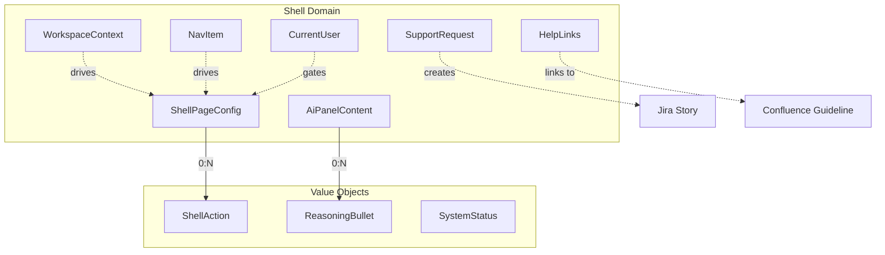
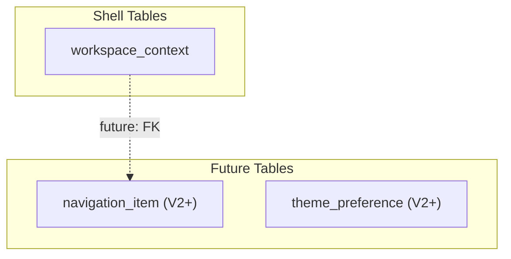
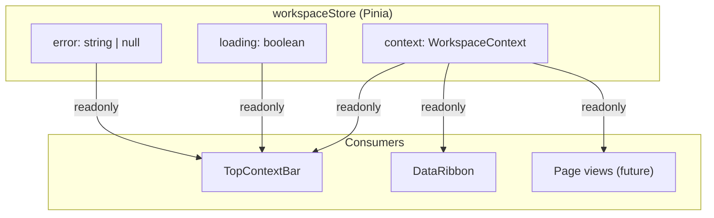
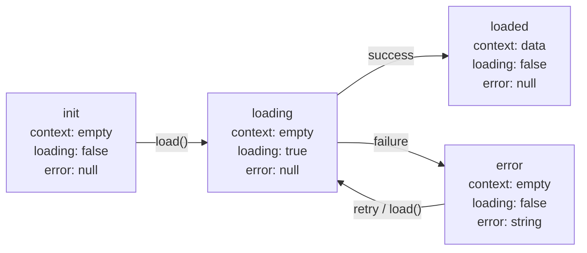

# Shared App Shell Data Model

## Purpose

This document defines the domain and persistent data model for the Shared App Shell,
covering frontend types, backend DTOs/entities, and the database schema.

## Traceability

- Architecture: [shared-app-shell-architecture.md](shared-app-shell-architecture.md)
- Design: [shared-app-shell-design.md](../05-design/shared-app-shell-design.md)
- Spec: [shared-app-shell-spec.md](../03-spec/shared-app-shell-spec.md)
- Types source: `frontend/src/shared/types/shell.ts`

---

## 1. Domain Model Overview



---

## 2. Frontend Type Model

All types are defined in `frontend/src/shared/types/shell.ts`.

### 2.1 WorkspaceContext

The global workspace context displayed in the TopContextBar.

```typescript
interface WorkspaceContext {
  workspaceId?: string | null;       // Optional — canonical workspace id
  workspace: string;              // Required — workspace name
  applicationId?: string | null;      // Optional — canonical application id
  application: string;            // Required — application name
  snowGroupId?: string | null;        // Optional — canonical SNOW group id
  snowGroup?: string | null;      // Optional — ServiceNow group
  projectId?: string | null;          // Optional — canonical project id
  project?: string | null;        // Optional — project name
  environment?: string | null;    // Optional — environment name
  demoMode?: boolean;                 // True when guest/demo data is active
}
```

| Field | Required | Display Label | Empty Fallback |
|-------|----------|---------------|----------------|
| `workspace` | Yes | "Workspace" | N/A (always present) |
| `application` | Yes | "Application" | N/A (always present) |
| `snowGroup` | No | "SNOW Group" | `---` |
| `project` | No | "Project" | `---` |
| `environment` | No | "Environment" | `---` |

### 2.1A CurrentUser

```typescript
type UserMode = 'staff' | 'guest';
type AuthProvider = 'manual' | 'teambook' | 'guest';

interface CurrentUser {
  mode: UserMode;
  authProvider: AuthProvider;
  staffId: string | null;
  displayName: string;
  staffName?: string | null;
  avatarUrl?: string | null;
  roles: string[];
  readOnly: boolean;
  scopes: ReadonlyArray<{ scopeType: string; scopeId: string }>;
}
```

### 2.1B SupportRequest

```typescript
interface SupportRequest {
  title: string;
  category: 'access' | 'data' | 'bug' | 'question' | 'enhancement';
  description: string;
  route: string;
  context: WorkspaceContext;
  reporterStaffId: string | null;
  reporterMode: UserMode;
}

interface SupportRequestResult {
  requestId: string;
  status: 'created' | 'pending';
  jiraKey?: string | null;
  jiraUrl?: string | null;
}
```

### 2.1C HelpLinks

```typescript
interface HelpLinks {
  userGuidelineUrl: string | null;
}
```

### 2.2 ShellPageConfig

Delivered via Vue Router route `meta` field. Drives PageHeader rendering.

```typescript
interface ShellPageConfig {
  navKey: string;                                   // Maps to NavItem.key for active state
  title: string;                                    // Page title
  subtitle?: string;                                // Optional subtitle
  actions?: ReadonlyArray<ShellAction>;              // Optional action buttons
}

interface ShellAction {
  key: string;                                      // Unique action identifier
  label: string;                                    // Button label
  variant?: 'default' | 'ai';                       // Visual variant
}
```

### 2.3 NavItem

Navigation entry rendered in PrimaryNav.

```typescript
interface NavItem {
  key: string;              // Unique route key (e.g., "dashboard", "incidents")
  label: string;            // Display label (e.g., "Incident Management")
  path: string;             // Route path (e.g., "/incidents")
  icon: string;             // Lucide icon name (e.g., "LayoutDashboard")
  comingSoon?: boolean;     // If true, item renders dimmed
}
```

### 2.4 AiPanelContent

Content for the AI Command Panel zones.

```typescript
interface AiPanelContent {
  summary: string;
  reasoning: ReadonlyArray<{
    text: string;
    status: 'ok' | 'warning' | 'error';
  }>;
  evidence: string;
}
```

### 2.5 SystemStatus

Status LED in the nav footer.

```typescript
type SystemStatus = 'ready' | 'degraded' | 'offline';
```

| Status | LED Color | Token |
|--------|-----------|-------|
| `ready` | Green | `--color-health-emerald` |
| `degraded` | Amber | `--color-approval-amber` |
| `offline` | Red | `--color-incident-crimson` |

---

## 3. Backend DTO/Entity Model

### 3.1 WorkspaceContext Entity (JPA)

```java
package com.sdlctower.platform.workspace;

@Entity
@Table(name = "workspace_context")
public class WorkspaceContext {
    @Id
    @GeneratedValue(strategy = GenerationType.IDENTITY)
    private Long id;

    @Column(name = "workspace_id")
    private String workspaceId;

    @Column(name = "workspace_name", nullable = false)
    private String workspace;

    @Column(name = "application_id")
    private String applicationId;

    @Column(name = "application_name", nullable = false)
    private String application;

    @Column(name = "snow_group_id")
    private String snowGroupId;

    @Column(name = "snow_group")
    private String snowGroup;

    @Column(name = "project_id")
    private String projectId;

    @Column(name = "project_name")
    private String project;

    @Column(name = "environment_name")
    private String environment;

    @Column(name = "demo_mode", nullable = false)
    private boolean demoMode;

    // getters (no setters — managed by JPA lifecycle)
}
```

### 3.2 WorkspaceContextDto (API-facing)

```java
package com.sdlctower.platform.workspace;

public record WorkspaceContextDto(
    String workspaceId,
    String workspace,
    String applicationId,
    String application,
    String snowGroupId,
    String snowGroup,      // nullable
    String projectId,
    String project,        // nullable
    String environment,    // nullable
    Boolean demoMode
) {
    public static WorkspaceContextDto fromEntity(WorkspaceContext entity) {
        return new WorkspaceContextDto(
            entity.getWorkspaceId(),
            entity.getWorkspace(),
            entity.getApplicationId(),
            entity.getApplication(),
            entity.getSnowGroupId(),
            entity.getSnowGroup(),
            entity.getProjectId(),
            entity.getProject(),
            entity.getEnvironment(),
            entity.isDemoMode()
        );
    }
}
```

### 3.3 NavItem Record (No Entity — Static in V1)

```java
package com.sdlctower.platform.navigation;

public record NavItem(
    String key,
    String label,
    String path,
    boolean comingSoon,
    String icon,
    int order
) {}
```

V1: Hardcoded in `NavigationService`. No database table.
V2+: May be driven by a `navigation_item` table for dynamic configuration.

### 3.4 Auth, Support, And Help DTOs

```java
public record CurrentUserDto(
    String mode,
    String authProvider,
    String staffId,
    String displayName,
    String staffName,
    String avatarUrl,
    List<String> roles,
    Boolean readOnly,
    List<ScopeDto> scopes
) {}

public record LoginRequest(String staffId, String password) {}

public record AuthProviderDto(
    String provider,
    String label,
    Boolean enabled,
    String startUrl
) {}

public record TeamBookProfileDto(
    String staffId,
    String staffName,
    String avatarUrl
) {}

public record SupportRequestDto(
    String title,
    String category,
    String description,
    String route,
    WorkspaceContextDto context,
    String reporterStaffId,
    String reporterMode
) {}

public record SupportRequestResultDto(
    String requestId,
    String status,
    String jiraKey,
    String jiraUrl
) {}

public record HelpLinksDto(String userGuidelineUrl) {}

public record ScopeDto(String scopeType, String scopeId) {}
```

V1 auth stores users in Platform Center's user/access tables; the shell consumes
the current-user DTO and does not own role-assignment persistence.

### 3.5 ApiResponse Envelope (Shared)

```java
package com.sdlctower.shared.dto;

public record ApiResponse<T>(T data, String error) {
    public static <T> ApiResponse<T> ok(T data) {
        return new ApiResponse<>(data, null);
    }
    public static <T> ApiResponse<T> fail(String error) {
        return new ApiResponse<>(null, error);
    }
}
```

---

## 4. Type Mapping — Frontend to Backend

| Frontend (TypeScript) | Backend (Java) | JSON Key | Nullable |
|-----------------------|----------------|----------|----------|
| `WorkspaceContext.workspaceId` | `WorkspaceContextDto.workspaceId` | `workspaceId` | Yes |
| `WorkspaceContext.workspace` | `WorkspaceContextDto.workspace` | `workspace` | No |
| `WorkspaceContext.applicationId` | `WorkspaceContextDto.applicationId` | `applicationId` | Yes |
| `WorkspaceContext.application` | `WorkspaceContextDto.application` | `application` | No |
| `WorkspaceContext.snowGroupId` | `WorkspaceContextDto.snowGroupId` | `snowGroupId` | Yes |
| `WorkspaceContext.snowGroup` | `WorkspaceContextDto.snowGroup` | `snowGroup` | Yes |
| `WorkspaceContext.projectId` | `WorkspaceContextDto.projectId` | `projectId` | Yes |
| `WorkspaceContext.project` | `WorkspaceContextDto.project` | `project` | Yes |
| `WorkspaceContext.environment` | `WorkspaceContextDto.environment` | `environment` | Yes |
| `WorkspaceContext.demoMode` | `WorkspaceContextDto.demoMode` | `demoMode` | No |
| `CurrentUser.authProvider` | `CurrentUserDto.authProvider` | `authProvider` | No |
| `CurrentUser.staffId` | `CurrentUserDto.staffId` | `staffId` | Yes for guest |
| `CurrentUser.readOnly` | `CurrentUserDto.readOnly` | `readOnly` | No |
| `CurrentUser.staffName` | `CurrentUserDto.staffName` | `staffName` | Yes |
| `CurrentUser.avatarUrl` | `CurrentUserDto.avatarUrl` | `avatarUrl` | Yes |
| `NavItem.key` | `NavItem.key` | `key` | No |
| `NavItem.label` | `NavItem.label` | `label` | No |
| `NavItem.path` | `NavItem.path` | `path` | No |
| `NavItem.icon` | `NavItem.icon` | `icon` | No |
| `NavItem.comingSoon` | `NavItem.comingSoon` | `comingSoon` | No (default false) |
| — | `NavItem.order` | `order` | No (backend only) |

---

## 5. Database Schema

Managed by Flyway migrations. JPA `ddl-auto` is only used for local H2 throwaway dev.

### 5.1 Entity Relationship Diagram



### 5.2 workspace_context Table

```sql
-- V1__create_workspace_context.sql
CREATE TABLE workspace_context (
    id                BIGINT GENERATED BY DEFAULT AS IDENTITY PRIMARY KEY,
    workspace_id      VARCHAR(64),
    workspace_name    VARCHAR(255) NOT NULL,
    application_id    VARCHAR(64),
    application_name  VARCHAR(255) NOT NULL,
    snow_group_id     VARCHAR(64),
    snow_group        VARCHAR(255),
    project_id        VARCHAR(64),
    project_name      VARCHAR(255),
    environment_name  VARCHAR(255),
    demo_mode         BOOLEAN DEFAULT FALSE NOT NULL
);
```

### 5.3 Seed Data

```sql
-- V2__seed_workspace_context.sql
INSERT INTO workspace_context (
    workspace_id, workspace_name, application_id, application_name,
    snow_group_id, snow_group, project_id, project_name, environment_name, demo_mode
) VALUES (
    'ws-default-001',
    'Global SDLC Tower',
    'app-payment-gateway-pro',
    'Payment-Gateway-Pro',
    'snow-fin-tech-ops',
    'FIN-TECH-OPS',
    'proj-42',
    'Q2-Cloud-Migration',
    'Production',
    FALSE
);
```

### 5.4 Column-to-Field Mapping

| DB Column | Java Entity Field | DTO Field | TypeScript Field |
|-----------|-------------------|-----------|------------------|
| `id` | `id` | (excluded) | (not exposed) |
| `workspace_id` | `workspaceId` | `workspaceId` | `workspaceId` |
| `workspace_name` | `workspace` | `workspace` | `workspace` |
| `application_id` | `applicationId` | `applicationId` | `applicationId` |
| `application_name` | `application` | `application` | `application` |
| `snow_group_id` | `snowGroupId` | `snowGroupId` | `snowGroupId` |
| `snow_group` | `snowGroup` | `snowGroup` | `snowGroup` |
| `project_id` | `projectId` | `projectId` | `projectId` |
| `project_name` | `project` | `project` | `project` |
| `environment_name` | `environment` | `environment` | `environment` |
| `demo_mode` | `demoMode` | `demoMode` | `demoMode` |

---

## 6. State Model

### 6.1 Pinia Store State



### 6.2 Store State Machine



### 6.3 Theme State (localStorage)

| Key | Type | Default | Persisted |
|-----|------|---------|-----------|
| `sdlc-tower-theme` | `'dark' \| 'light'` | `'dark'` | localStorage |

---

## 7. Navigation Items (V1 Static Data)

| # | Key | Label | Path | Coming Soon | Icon |
|---|-----|-------|------|-------------|------|
| 1 | `dashboard` | Dashboard | `/` | false | LayoutDashboard |
| 2 | `team` | Team Space | `/team` | true | Users |
| 3 | `project-space` | Project Space | `/project-space` | false | FolderKanban |
| 4 | `requirements` | Requirement Mgmt | `/requirements` | true | FileText |
| 5 | `project-management` | Project Mgmt | `/project-management` | true | Kanban |
| 6 | `design` | Design Mgmt | `/design` | true | Palette |
| 7 | `code` | Code & Build | `/code` | true | Code |
| 8 | `testing` | Testing | `/testing` | true | TestTube |
| 9 | `deployment` | Deployment | `/deployment` | true | Rocket |
| 10 | `incidents` | Incident Mgmt | `/incidents` | false | AlertTriangle |
| 11 | `ai-center` | AI Center | `/ai-center` | true | Bot |
| 12 | `reports` | Report Center | `/reports` | true | BarChart3 |
| 13 | `platform` | Platform Center | `/platform` | false | Settings |
